# 如何使用Spring-AI实现完整的ChatAgent产品

本文主要介绍了Spring-AI源码的核心概念和设计思路。以及怎样通过Spring-AI实现一个完整的ChatAgent产品

开源代码地址 https://github.com/benym/spring-ai-fullstack-demo

项目依赖版本
- Spring AI: 1.0.0
- Spring AI Alibaba: 1.0.0.2
- Spring AI Alibaba Memory: 1.0.0.3

第一次加载时需要拉取CDN的前端JS，尽量保持网络可以访问外网，避免显示效果不全

加载完成后形成前端缓存，后续就不用拉了

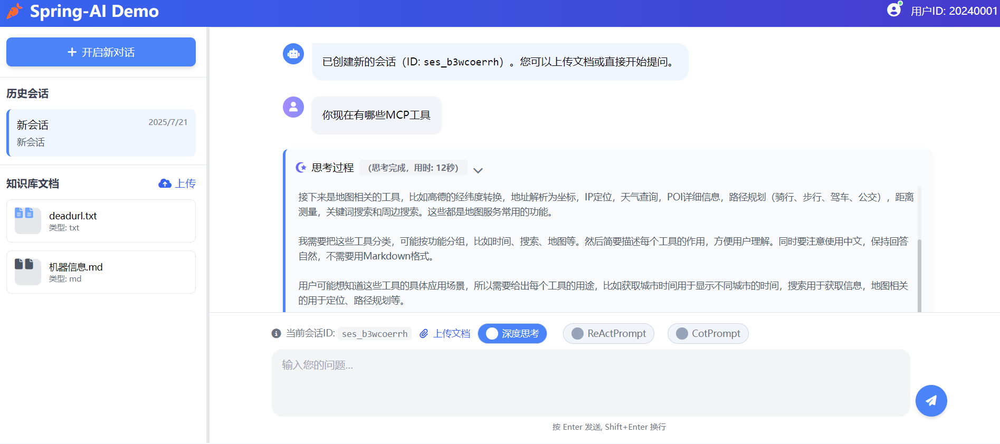

整个项目依附的基础设施包括Redis(存储记忆)，Es(向量数据库，RAG文档)

依赖第三方能力的Chat(阿里云百炼api key)、Tool能力(项目内Tool，项目外Tool魔搭社区)

## Advisor

Advisor在spring ai中直译为顾问，其实本质上和Spring AOP切面是一种东西，内部是责任链实现，这部分Advisor主要是对chat交互过程中进行增强

比如最简单的内置日志Advisor

`org.springframework.ai.chat.client.advisor.SimpleLoggerAdvisor`

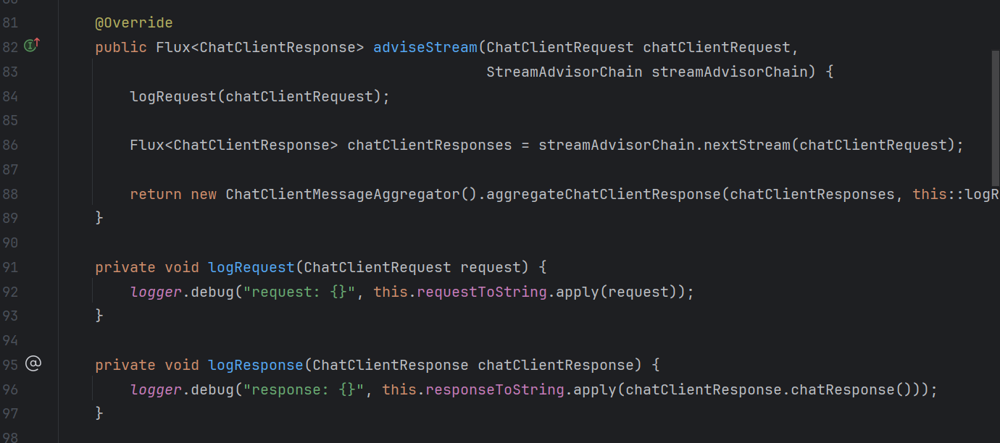

很明显看得处理adviseStream是前后增强的模式

Advisor可以扩展的很多，比如后面实现的Memory也是通过Advisor

## Transformer

transformer就是转化器的意思，一般使用在大模型api交互前，比如使用`org.springframework.ai.rag.preretrieval.query.transformation.TranslationQueryTransformer`

进行语言转化，比如讲用户输入的英文转化为中文

### 工程侧Transformer原理是什么

通常来讲，Spring AI内置的Transformer都是以定制Prompt的形式实现的，其中还需要过一遍大模型的交互，以`TranslationQueryTransformer`为例

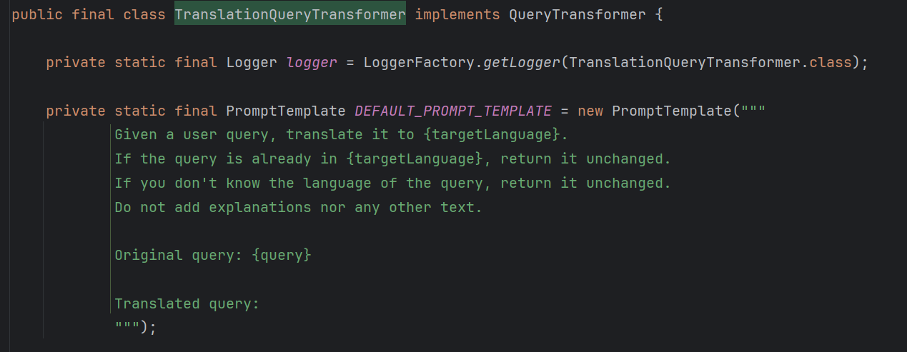

提示词很直观，就是给定用户的提问，转化为对应的语言，如果已经是该语言，则不处理，如果不是就翻译

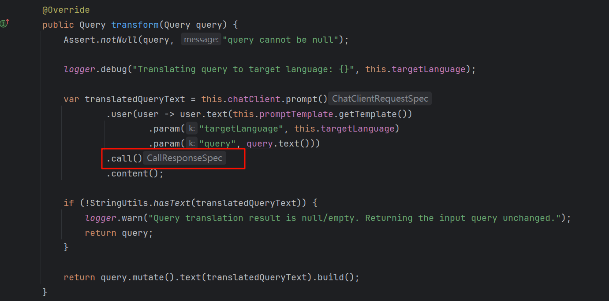

需要注意的是，目前官方实现的所有Transformer都是`call()`模式调用的大模型，及同步调用，这种调用在**如果作为组件串联在异步流程中会报错**，比如使用在后面的RAG工作流的`RetrievalAugmentationAdvisor`中，因为无法在完全异步流程中等待同步调用

### 为什么不实现Transformer的stream调用

实际上自己实现一个Stream流式类型的Transformer翻译完全只需要改动几行代码，比如我们项目中

`com.demo.spring.ai.fullstack.advisor.pre.StreamTranslationQueryTransformer`

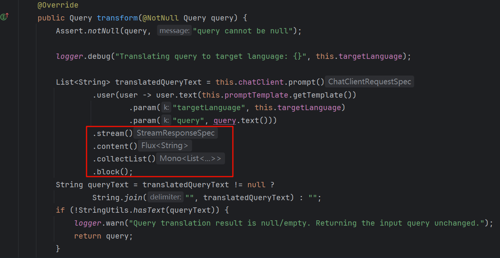

将call同步调用变成stream流式，由于要保持格式统一，还可以block等待返回完毕了再出去

但由于改动相对简单，我们可以思考一下为什么Spring官方不实现这种模式

通过观察spring-ai及spring-ai-alibaba的issue和pr，我们可以发现的一个观点是

**对于功能性确定，不需要对用户展示的转化，实现流式几乎没有意义**，也就是说，作为交互的一个前置流程(比如将用户的提问翻译为特定语言，然后再提交给大模型)，在翻译完成之前，让大模型就异步流式执行，是不必要的，等于翻译还没完，大模型已经开始吐字了，这种情况增加了实现难度，又让异步流变得没有意义

另外，在实际的测试过程中，虽然这种异步转同步的假异步方式Transformer实现，让后续的RAG工作流能够跑通了，**但实际上耗时远远超过了纯使用call()方法同步的耗时**，所以在这个项目中，stream的Transformer没有默认开启

## Memory

Spring AI官方没有提供一个基于Redis作为Memory的样例，包括Spring AI Alibaba，目前也只是实现了单机Redis作为Memory，这不太符合生产环境的使用方式。通过观察比如JDBC作为记忆的实现，我们可以发现其本质都是实现了`ChatMemoryRepository`的接口，所以我们也可以实现这个接口，实现自己的记忆存储

### 将Redis(Redisson)集群作为Memory

比如项目中的`RedissonChatMemoryRepository`，我们以Redisson作为客户端，实现集群模式下的Redis记忆

```java
public class RedissonChatMemoryRepository implements ChatMemoryRepository, AutoCloseable {

    private static final Logger logger = LoggerFactory.getLogger(RedissonChatMemoryRepository.class);
    private static final String DEFAULT_KEY_PREFIX = "spring_ai_alibaba_chat_memory:";

    private final RedissonClient redissonClient;
    private final ObjectMapper objectMapper;

    private RedissonChatMemoryRepository(RedissonClient redissonClient) {
        Assert.notNull(redissonClient, "redissonClient cannot be null");
        this.redissonClient = redissonClient;
        this.objectMapper = createObjectMapper();
    }

    private ObjectMapper createObjectMapper() {
        ObjectMapper mapper = new ObjectMapper();
        SimpleModule module = new SimpleModule();
        module.addDeserializer(Message.class, new MessageDeserializer());
        mapper.registerModule(module);
        return mapper;
    }

    public static RedissonBuilder builder() {
        return new RedissonBuilder();
    }

    public static class RedissonBuilder {
        private String host = "127.0.0.1";

        private int port = 6379;

        private String password;

        private int timeout = 3000;

        private int poolSize = 32;

        private RedisClusterConfig clusterConfig;

        private boolean useCluster = false;

        public RedissonBuilder host(String host) {
            this.host = host;
            return this;
        }

        public RedissonBuilder port(int port) {
            this.port = port;
            return this;
        }

        public RedissonBuilder password(String password) {
            this.password = password;
            return this;
        }

        public RedissonBuilder timeout(int timeout) {
            this.timeout = timeout;
            return this;
        }

        public RedissonBuilder poolSize(int poolSize) {
            this.poolSize = poolSize;
            return this;
        }

        public RedissonBuilder useCluster(RedisClusterConfig clusterConfig) {
            this.clusterConfig = clusterConfig;
            this.useCluster = true;
            return this;
        }

        public RedissonChatMemoryRepository build() {
            Config config = new Config();
            if (useCluster) {
                config.useClusterServers()
                        .addNodeAddress(clusterConfig.getNodeAddresses().toArray(new String[0]))
                        .setPassword(password)
                        .setConnectTimeout(timeout)
                        .setSlaveConnectionPoolSize(poolSize)
                        .setMasterConnectionPoolSize(poolSize);
            } else {
                config.useSingleServer()
                        .setAddress("redis://" + host + ":" + port)
                        .setPassword(password)
                        .setConnectionPoolSize(poolSize)
                        .setConnectTimeout(timeout);
            }
            return new RedissonChatMemoryRepository(Redisson.create(config));
        }
    }

    public static class RedisClusterConfig {

        private final List<String> nodeAddresses;

        public RedisClusterConfig(List<String> nodeAddresses) {
            Assert.notEmpty(nodeAddresses, "Cluster nodes cannot be empty");
            this.nodeAddresses = new ArrayList<>(nodeAddresses);
        }

        public List<String> getNodeAddresses() {
            return Collections.unmodifiableList(nodeAddresses);
        }
    }

    @NotNull
    @Override
    public List<String> findConversationIds() {
        RKeys keys = redissonClient.getKeys();
        // 使用推荐的ScanOptions替代已过时的getKeysByPattern
        KeysScanOptions scanOptions = KeysScanOptions.defaults()
                .pattern(DEFAULT_KEY_PREFIX + "*");
        Iterable<String> keysIter = keys.getKeys(scanOptions);
        // 使用Stream处理避免大keys列表OOM
        return StreamSupport.stream(keysIter.spliterator(), false)
                .map(key -> key.substring(DEFAULT_KEY_PREFIX.length()))
                .collect(Collectors.toList());
    }

    @NotNull
    @Override
    public List<Message> findByConversationId(@NotNull String conversationId) {
        Assert.hasText(conversationId, "conversationId cannot be null or empty");
        RList<String> redisList = redissonClient.getList(
                DEFAULT_KEY_PREFIX + conversationId
        );
        return redisList.readAll()
                .parallelStream()
                .map(this::deserializeMessage)
                .filter(Objects::nonNull)
                .collect(Collectors.toList());
    }

    private Message deserializeMessage(String messageStr) {
        try {
            return objectMapper.readValue(messageStr, Message.class);
        } catch (JsonProcessingException e) {
            logger.error("Deserialization error for message: {}", truncate(messageStr, 100), e);
            return null;
        }
    }

    private String truncate(String str, int maxLength) {
        return str.length() > maxLength
                ? str.substring(0, maxLength) + "..."
                : str;
    }

    @Override
    public void saveAll(@NotNull String conversationId, @NotNull List<Message> messages) {
        Assert.hasText(conversationId, "conversationId cannot be null or empty");
        Assert.notNull(messages, "messages cannot be null");
        Assert.noNullElements(messages, "messages cannot contain null elements");
        RList<String> redisList = redissonClient.getList(
                DEFAULT_KEY_PREFIX + conversationId
        );
        // 删除现有对话消息（原子操作）
        redisList.delete();
        // 批量添加所有消息（高效批处理）
        List<String> serializedMessages = messages.stream()
                .map(this::serializeMessage)
                .toList();
        redisList.addAll(serializedMessages);
    }

    private String serializeMessage(Message message) {
        try {
            return objectMapper.writeValueAsString(message);
        } catch (JsonProcessingException e) {
            throw new IllegalStateException("Serialization error for message: " + message, e);
        }
    }

    @Override
    public void deleteByConversationId(@NotNull String conversationId) {
        Assert.hasText(conversationId, "conversationId cannot be null or empty");
        RList<String> redisList = redissonClient.getList(
                DEFAULT_KEY_PREFIX + conversationId
        );
        redisList.delete();
    }

    @Override
    public void close() {
        if (redissonClient != null && !redissonClient.isShutdown()) {
            try {
                int activeConnections = redissonClient.getConfig().getNettyThreads();
                logger.info("Shutting down Redisson with {} active connections", activeConnections);
                redissonClient.shutdown();
                logger.info("Redisson client shutdown completed");
            } catch (Exception e) {
                logger.error("Error shutting down Redisson client", e);
            }
        }
    }
}
```

之后配置`MessageWindowChatMemory`，可以设置记忆的存储最大条数

```java
@Configuration
@Slf4j
public class MemoryConfig {

    private final int MAX_MESSAGES = 100;

    @Bean("messageMemory")
    public MessageWindowChatMemory messageWindowChatMemory(RedissonChatMemoryRepository redissonChatMemoryRepository) {
        log.info("Initializing MessageWindowChatMemory with max messages: {}", MAX_MESSAGES);
        return MessageWindowChatMemory.builder()
                .chatMemoryRepository(redissonChatMemoryRepository)
                .maxMessages(MAX_MESSAGES)
                .build();
    }
}
```

注册该记忆到对应的ChatClient

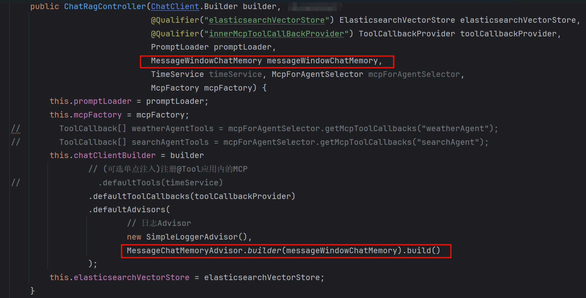

使用时可自定义参数，比如指明存储的会话id

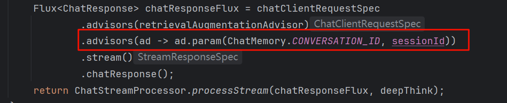

### 读取历史Memeory

```java
@RestController
@RequestMapping("/conversation")
@Slf4j
public class ConversationController {

    @Resource
    private MessageWindowChatMemory messageWindowChatMemory;

    @GetMapping("/messages")
    public List<Message> messages(@RequestParam(value = "sessionId") String sessionId) {
        return messageWindowChatMemory.get(sessionId);
    }
}
```

### 历史会话栏聊天记录实现思路

由于demo创建的时间关系，历史会话没有去实现，以下给出实现思路

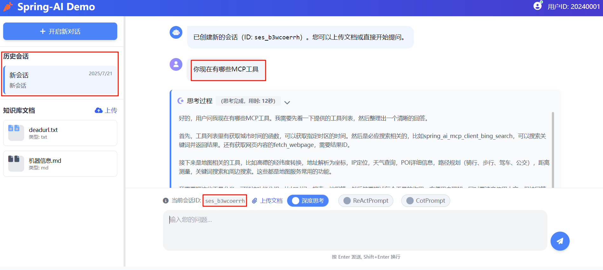

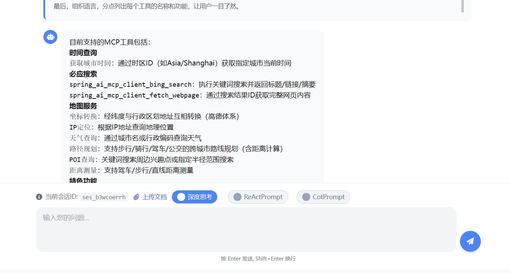

以上图为例

当用户和大模型发生交互后，历史会话会存储在redis中

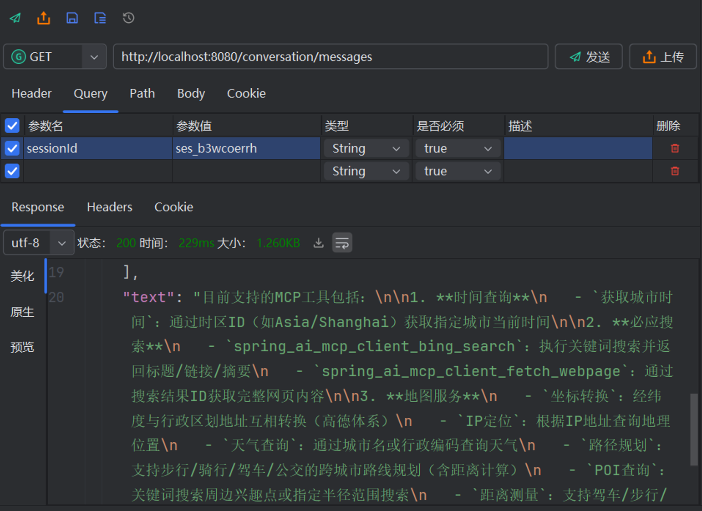

调用会话接口带上会话的sessionId就能够获取到完整的聊天记录

```json
[
  {
    "messageType": "USER",
    "metadata": {
      "messageType": "USER"
    },
    "media": [
    ],
    "text": "你现在有哪些MCP工具"
  },
  {
    "messageType": "ASSISTANT",
    "metadata": {
      "messageType": "ASSISTANT"
    },
    "toolCalls": [
    ],
    "media": [
    ],
    "text": "目前支持的MCP工具包括：\n\n1. **时间查询**\n   - `获取城市时间`：通过时区ID（如Asia/Shanghai）获取指定城市当前时间\n\n2. **必应搜索**\n   - `spring_ai_mcp_client_bing_search`：执行关键词搜索并返回标题/链接/摘要\n   - `spring_ai_mcp_client_fetch_webpage`：通过搜索结果ID获取完整网页内容\n\n3. **地图服务**\n   - `坐标转换`：经纬度与行政区划地址互相转换（高德体系）\n   - `IP定位`：根据IP地址查询地理位置\n   - `天气查询`：通过城市名或行政编码查询天气\n   - `路径规划`：支持步行/骑行/驾车/公交的跨城市路线规划（含距离计算）\n   - `POI查询`：关键词搜索周边兴趣点或指定半径范围搜索\n   - `距离测量`：支持驾车/步行/直线距离测量\n\n4. **特色功能**\n   - 可解析地标性建筑名称为坐标\n   - 支持公交规划自动关联火车/地铁/公交换乘方案\n   - 可测量多起点到单终点的批量距离计算\n\n需要具体使用哪个功能时告诉我即可调用~"
  }
]
```

但通过接口可以看到，这只存储了回答的答案，并没有去存储思考过程

所以更一般的，切面用法时需要识别think的内容，以及content的内容合并存储在记忆中，供后续查询出来进行渲染

新会话左侧，一般还有本次会话的主题是什么，所以整体的历史会话栏实现思路是：

1. 用户发起会话
2. 后端识别think和answer事件，合并存储记忆到redis中
3. 产生answer事件之后，后端采用如`com.demo.spring.ai.fullstack.etl.transformer.impl.SummaryDocumentTransformerStrategy`传入用户query上下文识别提问主题，之后发送summary事件给前端
4. 前端监听summary事件实现实时渲染会话主题
5. 用户点击会话框时，前端根据会话id调用后端记忆接口，根据返回值进行历史聊天记录渲染

## 向量数据库

### 将Elasticsearch作为向量数据库

```java
@Configuration
@Data
@Slf4j
public class ElasticsearchConfig {

    @Value("${spring.elasticsearch.uris}")
    private String url;

    @Value("${spring.elasticsearch.username}")
    private String username;

    @Value("${spring.elasticsearch.password}")
    private String password;

    @Value("${spring.ai.vectorstore.elasticsearch.index-name}")
    private String indexName;

    @Value("${spring.ai.vectorstore.elasticsearch.similarity}")
    private SimilarityFunction similarityFunction;

    @Value("${spring.ai.vectorstore.elasticsearch.dimensions}")
    private int dimensions;


    @Bean
    public RestClient restClient() {
        // 解析URL
        String[] uriParts = url.split(",");
        HttpHost[] hosts = new HttpHost[uriParts.length];
        for (int i = 0; i < uriParts.length; i++) {
            String[] hostPortParts = uriParts[i].trim().split(":");
            String host = hostPortParts[0];
            int port = Integer.parseInt(hostPortParts[1]);
            hosts[i] = new HttpHost(host, port);
        }
        // 创建凭证提供者
        CredentialsProvider credentialsProvider = new BasicCredentialsProvider();
        credentialsProvider.setCredentials(AuthScope.ANY,
                new UsernamePasswordCredentials(username, password));
        log.info("create elasticsearch rest client");
        // 构建RestClient
        return RestClient.builder(hosts)
                .setHttpClientConfigCallback(httpClientBuilder -> {
                    httpClientBuilder.setDefaultCredentialsProvider(credentialsProvider);
                    return httpClientBuilder;
                })
                .build();
    }

    @Bean
    @Qualifier("elasticsearchVectorStore")
    public ElasticsearchVectorStore vectorStore(RestClient restClient, EmbeddingModel embeddingModel) {
        log.info("create elasticsearch vector store");
        ElasticsearchVectorStoreOptions options = new ElasticsearchVectorStoreOptions();
        // Optional: defaults to "spring-ai-document-index"
        options.setIndexName(indexName);
        // Optional: defaults to COSINE
        options.setSimilarity(similarityFunction);
        // Optional: defaults to model dimensions or 1536
        options.setDimensions(dimensions);
        return ElasticsearchVectorStore.builder(restClient, embeddingModel)
                // Optional: use custom options
                .options(options)
                // Optional: defaults to false
                .initializeSchema(true)
                // Optional: defaults to TokenCountBatchingStrategy
                .batchingStrategy(new TokenCountBatchingStrategy())
                .build();
    }
}
```

用向量存储构建`Retriever`，并用在chat交互流程中

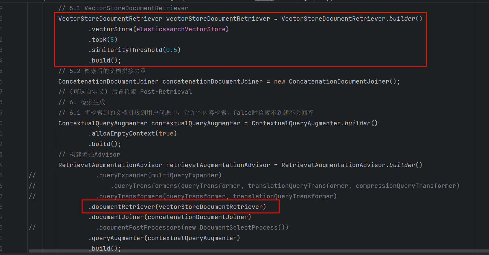

## RAG流水线

在整个chat过程中，RAG是让大模型拥有外部知识的重要的一环，业界已经有很多关于RAG的通用方法，在Spring AI中也有相应的简单实现，当然在实际应用过程中，这些小的方法并不一定会是直接堆砌就能够带来更好的效果，有的时候改写和扩展的结果可能会造成语义上的漂移，所以合理的动态使用组件，什么时候用组件还是比较重要的

### 查询改写

查询改写会将用户的提问改写为更好的形式

spring-ai内置的查询改写

`org.springframework.ai.rag.preretrieval.query.transformation.RewriteQueryTransformer`

同样的是以prompt的形式实现

```java
public class RewriteQueryTransformer implements QueryTransformer {

	private static final Logger logger = LoggerFactory.getLogger(RewriteQueryTransformer.class);

	private static final PromptTemplate DEFAULT_PROMPT_TEMPLATE = new PromptTemplate("""
			Given a user query, rewrite it to provide better results when querying a {target}.
			Remove any irrelevant information, and ensure the query is concise and specific.

			Original query:
			{query}

			Rewritten query:
			""");
    // 省略代码
}
```

使用时

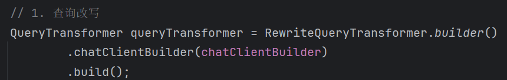

### 查询扩展

查询扩展会将用户的提问生成为多个不通角度的版本，让模型综合处理之后再返回

比如`org.springframework.ai.rag.preretrieval.query.expansion.MultiQueryExpander`

prompt为

```java
public final class MultiQueryExpander implements QueryExpander {

	private static final Logger logger = LoggerFactory.getLogger(MultiQueryExpander.class);

	private static final PromptTemplate DEFAULT_PROMPT_TEMPLATE = new PromptTemplate("""
			You are an expert at information retrieval and search optimization.
			Your task is to generate {number} different versions of the given query.

			Each variant must cover different perspectives or aspects of the topic,
			while maintaining the core intent of the original query. The goal is to
			expand the search space and improve the chances of finding relevant information.

			Do not explain your choices or add any other text.
			Provide the query variants separated by newlines.

			Original query: {query}

			Query variants:
			""");
}
```

使用时

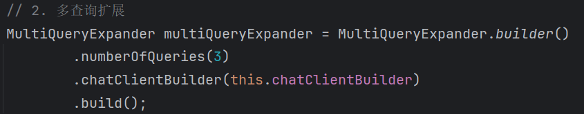

### 查询压缩

查询压缩能够结合用户的历史提问和当前提问合并成一个简洁，独立的查询

`org.springframework.ai.rag.preretrieval.query.transformation.CompressionQueryTransformer`

prompt为

```java
public class CompressionQueryTransformer implements QueryTransformer {

	private static final Logger logger = LoggerFactory.getLogger(CompressionQueryTransformer.class);

	private static final PromptTemplate DEFAULT_PROMPT_TEMPLATE = new PromptTemplate("""
			Given the following conversation history and a follow-up query, your task is to synthesize
			a concise, standalone query that incorporates the context from the history.
			Ensure the standalone query is clear, specific, and maintains the user's intent.

			Conversation history:
			{history}

			Follow-up query:
			{query}

			Standalone query:
			""");
}
```

使用时

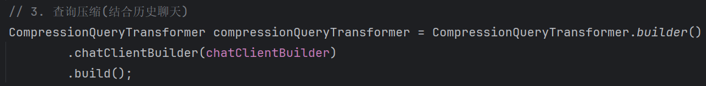

### 语言转化

语言转化能够将用户的提问转化为对应的语言

`org.springframework.ai.rag.preretrieval.query.transformation.TranslationQueryTransformer`

prompt为

```java
public final class TranslationQueryTransformer implements QueryTransformer {

	private static final Logger logger = LoggerFactory.getLogger(TranslationQueryTransformer.class);

	private static final PromptTemplate DEFAULT_PROMPT_TEMPLATE = new PromptTemplate("""
			Given a user query, translate it to {targetLanguage}.
			If the query is already in {targetLanguage}, return it unchanged.
			If you don't know the language of the query, return it unchanged.
			Do not add explanations nor any other text.

			Original query: {query}

			Translated query:
			""");
}
```

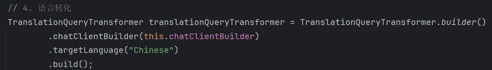

### 文档去重

对于召回的文档进行去重

`org.springframework.ai.rag.retrieval.join.ConcatenationDocumentJoiner`

这个实现很简单，根据文档id做的map去重

```java
public class ConcatenationDocumentJoiner implements DocumentJoiner {

	private static final Logger logger = LoggerFactory.getLogger(ConcatenationDocumentJoiner.class);

	@Override
	public List<Document> join(Map<Query, List<List<Document>>> documentsForQuery) {
		Assert.notNull(documentsForQuery, "documentsForQuery cannot be null");
		Assert.noNullElements(documentsForQuery.keySet(), "documentsForQuery cannot contain null keys");
		Assert.noNullElements(documentsForQuery.values(), "documentsForQuery cannot contain null values");

		logger.debug("Joining documents by concatenation");

		return new ArrayList<>(documentsForQuery.values()
			.stream()
			.flatMap(List::stream)
			.flatMap(List::stream)
			.collect(Collectors.toMap(Document::getId, Function.identity(), (existing, duplicate) -> existing))
			.values()
			.stream()
			.sorted(Comparator.comparingDouble((Document doc) -> doc.getScore() != null ? doc.getScore() : 0.0)
				.reversed())
			.toList());
	}

}
```

### 后处理

后处理在spring-ai中没有默认实现，但提供了对应的接口，通常是来做类似这样的事情

比如在从向量数据库中召回文档之后，我们去做`Rerank`或者是只保留召回的第一个文档，我们可以实现

`org.springframework.ai.rag.postretrieval.document.DocumentPostProcessor`

比如只保留第一个文档

```java
public class DocumentSelectProcess implements DocumentPostProcessor {

    @NotNull
    @Override
    public List<Document> process(@NotNull Query query, @NotNull List<Document> documents) {
        if (documents.isEmpty()) {
            return Collections.emptyList();
        }
        return Collections.singletonList(documents.get(0));
    }
}
```

然后在流水线中使用

###  流水线总览

通常我们可以使用`RetrievalAugmentationAdvisor`来构建模块化的RAG增强流程，比如如果我们将上面的流程串起来，那么可以得到串行的RAG工作流

```java
/**
 * 同步chat接口，仅适用于RetrievalAugmentationAdvisor内各个组件都采用call()方法阻塞式返回消息
 *
 * @param query     用户输入
 * @param userId    用户id
 * @param sessionId 会话id
 * @param deepThink 是否开启深度思考
 * @param response  返回响应
 * @return String
 */
@GetMapping(value = "/chat/sync", produces = MediaType.TEXT_EVENT_STREAM_VALUE)
public String syncChat(@RequestParam(value = "query") String query,
                       @RequestParam(value = "userId") String userId,
                       @RequestParam(value = "sessionId") String sessionId,
                       @RequestParam(value = "deepThink") Boolean deepThink,
                       HttpServletResponse response) {
    log.info("query: {}, userId: {}, sessionId: {}, deepThink: {}", query, userId, sessionId, deepThink);
    response.setCharacterEncoding("UTF-8");
    // 1. 查询改写
    QueryTransformer queryTransformer = RewriteQueryTransformer.builder()
            .chatClientBuilder(chatClientBuilder)
            .build();
    // 2. 多查询扩展
    MultiQueryExpander multiQueryExpander = MultiQueryExpander.builder()
            .numberOfQueries(3)
            .chatClientBuilder(this.chatClientBuilder)
            .build();
    // 3. 查询压缩(结合历史聊天)
    CompressionQueryTransformer compressionQueryTransformer = CompressionQueryTransformer.builder()
            .chatClientBuilder(chatClientBuilder)
            .build();
    // 4. 语言转化
    TranslationQueryTransformer translationQueryTransformer = TranslationQueryTransformer.builder()
            .chatClientBuilder(this.chatClientBuilder)
            .targetLanguage("Chinese")
            .build();
    // 5. Retrieval检索增强
    // 5.1 VectorStoreDocumentRetriever
    VectorStoreDocumentRetriever vectorStoreDocumentRetriever = VectorStoreDocumentRetriever.builder()
            .vectorStore(elasticsearchVectorStore)
            .topK(5)
            .similarityThreshold(0.5)
            .build();
    // 5.2 检索后的文档拼接去重
    ConcatenationDocumentJoiner concatenationDocumentJoiner = new ConcatenationDocumentJoiner();
    // (可选自定义) 后置检索 Post-Retrieval
    // 6. 检索生成
    // 6.1 将检索到的文档拼接到用户问题中，允许空内容检索，false时检索不到就不会回答
    ContextualQueryAugmenter contextualQueryAugmenter = ContextualQueryAugmenter.builder()
            .allowEmptyContext(true)
            .build();
    // 构建增强Advisor
    RetrievalAugmentationAdvisor retrievalAugmentationAdvisor = RetrievalAugmentationAdvisor.builder()
            .queryExpander(multiQueryExpander)
            .queryTransformers(queryTransformer, translationQueryTransformer, compressionQueryTransformer)
            .documentRetriever(vectorStoreDocumentRetriever)
            .documentJoiner(concatenationDocumentJoiner)
            .documentPostProcessors(new DocumentSelectProcess())
            .queryAugmenter(contextualQueryAugmenter)
            .build();
    List<Message> messages = new ArrayList<>();
    messages.add(new UserMessage(query));
    Prompt prompt = Prompt.builder()
            .messages(messages)
            .build();
    return this.chatClientBuilder.build()
            .prompt(prompt)
            .advisors(retrievalAugmentationAdvisor)
            .advisors(ad -> ad.param(ChatMemory.CONVERSATION_ID, sessionId))
            .call()
            .content();
}
```

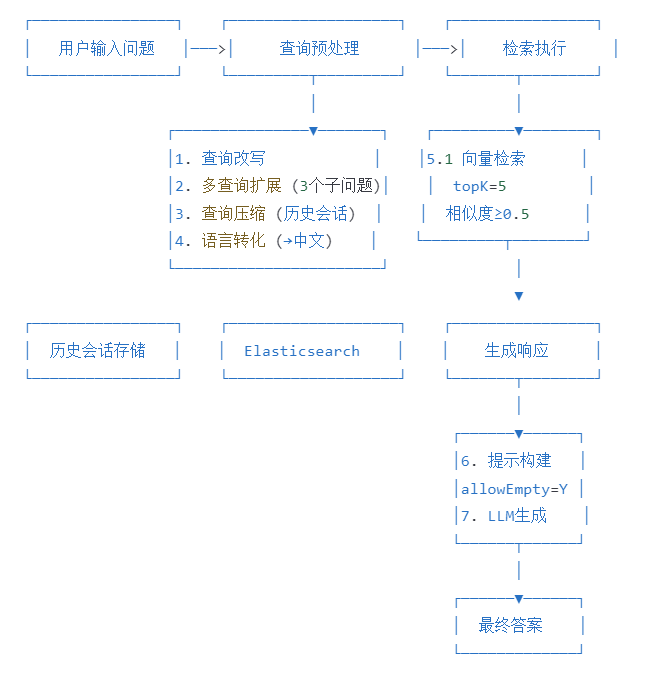

## 多类型文档读取

复杂文档读取的质量和chunk策略直接决定RAG的质量，这方面的文章也很多，比如**重叠冗余切片(Overlap)，chunk目录树状生成**，对于复杂的文档识别规则也有很多单独做垂类的文档创业企业，项目中实现了一些比较通用的文档转化为向量数据库需要的Document方法，包括Html、Json、markdown、pdf、text、任意(tika)

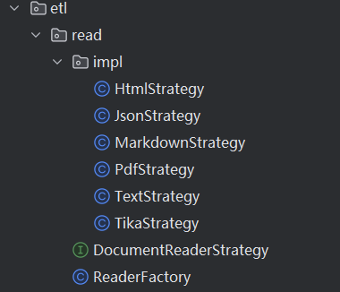

### Chunk

采用`org.springframework.ai.transformer.splitter.TokenTextSplitter`可以自定义自己的chunk策略，根据策略将文档进行切片，比如项目内实现的

```java
@Component
public class TokenTextDocumentTransformerStrategy implements DocumentTransformerStrategy {
    @Override
    public List<Document> transform(List<Document> documents) {
        TokenTextSplitter tokenTextSplitter = TokenTextSplitter.builder()
                // 每个文本块的目标token数量
                .withChunkSize(800)
                // 每个文本块的最小字符数
                .withMinChunkSizeChars(350)
                // 丢弃小于此长度的文本块
                .withMinChunkLengthToEmbed(5)
                // 文本中生成的最大块数
                .withMaxNumChunks(10000)
                // 是否保留分隔符
                .withKeepSeparator(true)
                .build();
        return tokenTextSplitter.apply(documents);
    }

    @Override
    public String transformType() {
        return TransformerTypeEnum.TOKEN.getCode();
    }
}
```

### RAG文档增删查

上传功能

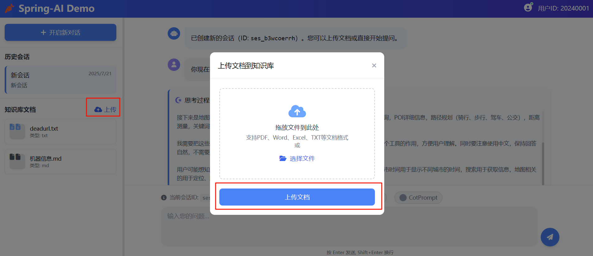

删除功能

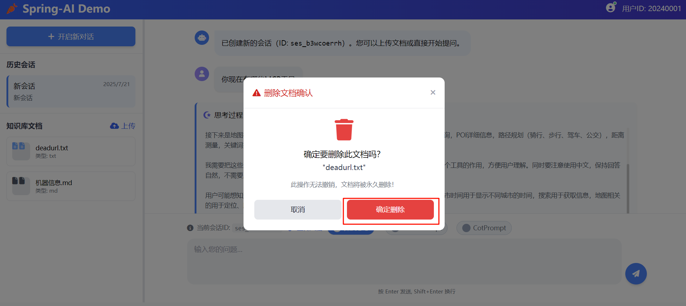

获取历史上传文档功能

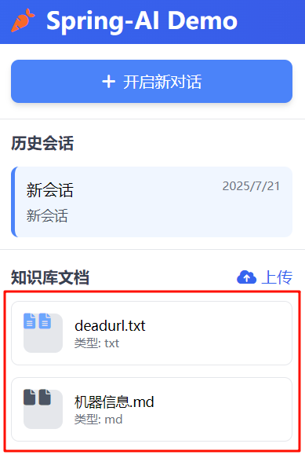

除了这些功能之外，还可以增加的是文档预览，这个在上传的时候带上内部文件服务器的路径存储，查询时回显对应文件路径就可以做到，由于时间关系，这部分没有去实现

他们对应的实现在

`com.demo.spring.ai.fullstack.controller.FileController`

这部分实现的时候需要注意将用户的信息和文档进行关联，以及一些自定义key的存储和传统的操作ES不太一样，由于更高级的api包装，开发者需要了解一定的Spring AI Document的自定义填充和合并、以及Spring AI Vector接口的用法

比如我在开发的时候使用的自定义key和合并能力

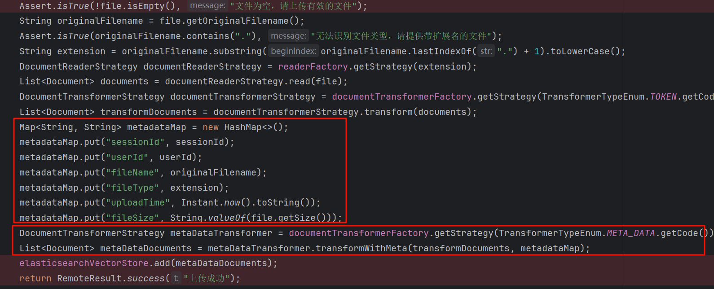

## MCP

一般在spring ai项目中可以采用application.yml中去配置MCP

```java
spring.ai.openai.base-url=https://dashscope.aliyuncs.com/compatible-mode/
spring.ai.openai.chat.options.model=qwen-max
spring.ai.openai.api-key=${OPEN_API_KEY}
spring.ai.mcp.client.sse.connections.server1.url=https://mcp.amap.com
spring.ai.mcp.client.sse.connections.server1.sse-endpoint=/sse?key=您在高德官网上申请的api-key
```

然后spring会自动注入这部分tool到chatClient中

目前市面上绝大多数的MCP工具都是由Python实现的，甚至有些厂商提供出来的Api背后可能还是另外一种语言，所以基于SSE模式的MCP调用是非常有必要的

### 直接使用MCP配置文件连接外部API的问题

通常直接使用上述功能在oneAgent模式下没有太大问题，但是现有的业界火热的项目如Manus、DeepSearch等，都是采用多Agent模式，在多Agent下如果把所有tool都分配给各个Agent，不符合资源隔离的原则，**为了更强的执行确定性，AI Agent是需要能够支持不同底层模型，绑定不同Tool的方式**，但目前Spring AI还没官方实现这点，但是只要知道原理我们也能够实现这种功能

### @Tool定义Fuctioncall的局限

在Spring-AI中除了提供基于sse链接的MCP，还有stdio模式的MCP，但个人认为在生产环境几乎不会使用到stdio模式(即使我们可以利用Docker把Python和Java环境结合在一起)。除了远程和本地的方式，还可以通过@Tool定义一个Function，然后在@Tool标注的方法下，用HTTP请求调用现有的存量接口，这样做可以接入一些API，但是这看起来还是非常局限的，因为定义@Tool需要告知这次调用这个API的@ToolParam是什么，**这也导致@Tool定义的Function实现MCP与API是一对一的关系**，也就是说需要像以往Dubbo暴露一样，一个一个对接。**这和直接使用MCP SSE对接远程MCP有着天然区别，对接SSE MCP时，我们并不需要知道这个SSE链接背后有多少个API**，可能是10个，可能是100个，也不需要知道这些API的参数是什么，因为通过MCP协议，Client端能够在连接远程MCP的时候感知到所有的API和需要的参数

### Mcp多Agent情况下分配

为了简单起见，我们可以定义一个`mcp-config.json`文件，这个文件在真实生产环境下可以放在nacos、zk等注册中心上，大概如下

```java
{
  "searchAgent": {
    "mcp-servers": [
      {
        "url" : "https://mcp.api-inference.modelscope.net",
        "sseEndpoint": "/2322845aebb640/sse",
        "description": "必应联网搜索服务",
        "enabled": true
      },
      {
        "url" : "https://mcp.api-inference.modelscope.net",
        "sseEndpoint": "/a4abcaa665604e/sse",
        "description": "高德地图服务",
        "enabled": true
      }
    ]
  },
  "weatherAgent": {
    "mcp-servers": [
      {
        "url" : "https://mcp.api-inference.modelscope.net",
        "sseEndpoint": "/44cdf894707a44/sse",
        "description": "天气服务",
        "enabled": true
      }
    ]
  }
}
```

上面定义了2个Agent可以使用的工具

1. searchAgent可以使用`必应联网搜索服务`和`高德地图服务`
2. weatherAgent可以使用`天气服务`

上述链接是来自于魔搭社区MCP广场的服务，在使用时需要账户去获取MCP SSE远程链接，其中Json的格式是我自己自定义的，为了后续动态组装MCP Client，实现动态分配，这部分难度稍高需要有一定的starter组件封装经验、以及MCP原生Client使用经验，还需要对Spring AI的MCP源码有一定的了解

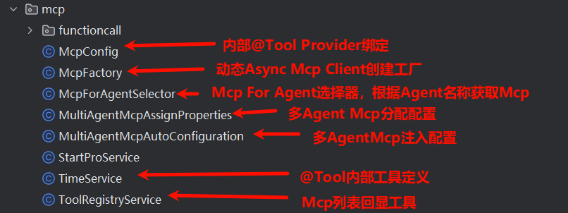

`TimeService`是一个基于@Tool注解定义的Function，用来获取城市时间

```java
@Service
public class TimeService {

    private static final Logger logger = LoggerFactory.getLogger(TimeService.class);

    @Tool(name = "获取城市时间", description = "Get the time of a specified city.")
    public String getCityTimeMethod(@ToolParam(description = "Time zone id, such as Asia/Shanghai") String timeZoneId) {
        logger.info("The current time zone is {}", timeZoneId);
        return String.format("The current time zone is %s and the current time is " + "%s", timeZoneId,
                getTimeByZoneId(timeZoneId));
    }

    private String getTimeByZoneId(String zoneId) {
        ZoneId zid = ZoneId.of(zoneId);
        ZonedDateTime zonedDateTime = ZonedDateTime.now(zid);
        DateTimeFormatter formatter = DateTimeFormatter.ofPattern("yyyy-MM-dd HH:mm:ss");
        return zonedDateTime.format(formatter);
    }
}
```

`McpConfig`是一个组装内部@Tool工具集合的ToolCallbackProvider的自动注入类

```java
@Configuration
public class McpConfig {

    @Bean(name = "innerMcpToolCallBackProvider")
    public ToolCallbackProvider mcpTools(TimeService timeService) {
        return MethodToolCallbackProvider.builder()
                .toolObjects(timeService)
                .build();
    }
}
```

`McpForAgentSelector`是一个通过mcp-config.json中的Agent名称获取mcp ToolCallBack定义的工具

```java
@Configuration
public class McpForAgentSelector {

    @Autowired(required = false)
    private Map<String, AsyncMcpToolCallbackProvider> agent2AsyncMcpToolCallbackProvider;

    @Autowired(required = false)
    private Map<String, SyncMcpToolCallbackProvider> agent2SyncMcpToolCallbackProvider;

    /**
     * 获取指定代理的MCP工具回调
     */
    public ToolCallback[] getMcpToolCallbacks(String agentName) {
        if (CollectionUtils.isEmpty(agent2SyncMcpToolCallbackProvider)
                && CollectionUtils.isEmpty(agent2AsyncMcpToolCallbackProvider)) {
            return new ToolCallback[0];
        }
        if (!CollectionUtils.isEmpty(agent2SyncMcpToolCallbackProvider)) {
            SyncMcpToolCallbackProvider toolCallbackProvider = agent2SyncMcpToolCallbackProvider.get(agentName);
            return toolCallbackProvider.getToolCallbacks();
        } else {
            AsyncMcpToolCallbackProvider toolCallbackProvider = agent2AsyncMcpToolCallbackProvider.get(agentName);
            return toolCallbackProvider.getToolCallbacks();
        }
    }
}
```

`MultiAgentMcpAutoConfiguration`是一个组装Agent和MCP关系Map的配置类，其中注入了`McpForAgentSelector`需要的`agent2AsyncMcpToolCallbackProvider`和`agent2SyncMcpToolCallbackProvider`

```java
@ConditionalOnProperty(prefix = MultiAgentMcpAssignProperties.MCP_ASSIGN_PROPERTIES_PREFIX, name = "enabled", havingValue = "true")
@EnableConfigurationProperties({MultiAgentMcpAssignProperties.class, McpClientCommonProperties.class})
@Configuration
@Slf4j
public class MultiAgentMcpAutoConfiguration {

    @Resource
    private MultiAgentMcpAssignProperties multiAgentMcpAssignProperties;

    @Resource
    private McpClientCommonProperties commonProperties;

    @Resource
    private ResourceLoader resourceLoader;

    @Resource
    private ObjectMapper objectMapper;

    @Resource
    private WebClient.Builder webClientBuilderTemplate;

    /**
     * 读取项目中的mcp JSON配置文件
     * key: agent名称，value: mcp配置实体
     */
    @Bean(name = "agent2mcpConfig")
    public Map<String, MultiAgentMcpAssignProperties.McpServerConfig> agent2mcpConfig() {
        try {
            org.springframework.core.io.Resource resource = resourceLoader.getResource(multiAgentMcpAssignProperties.getMcpConfigLocation());
            if (!resource.exists()) {
                return new HashMap<>();
            }
            try (InputStream inputStream = resource.getInputStream()) {
                TypeReference<Map<String, MultiAgentMcpAssignProperties.McpServerConfig>> typeRef = new TypeReference<>() {
                };
                return objectMapper.readValue(inputStream, typeRef);
            }
        } catch (IOException e) {
            log.error("读取MCP配置失败", e);
            return new HashMap<>();
        }
    }

    /**
     * agent对应的的MCP传输列表
     * key：agent名称，value: mcp transport list
     */
    @Bean(name = "agent2Transports")
    public Map<String, List<NamedClientMcpTransport>> agent2Transports(
            @Qualifier("agent2mcpConfig") Map<String, MultiAgentMcpAssignProperties.McpServerConfig> mcpAgentConfigs) {
        // 省略代码
        return agent2Transports;
    }

    /**
     * 创建按代理分组的AsyncMcpToolCallbackProvider Map
     */
    @Bean(name = "agent2AsyncMcpToolCallbackProvider")
    @ConditionalOnProperty(prefix = "spring.ai.mcp.client", name = {"type"}, havingValue = "ASYNC")
    public Map<String, AsyncMcpToolCallbackProvider> agent2AsyncMcpToolCallbackProvider(
            @Qualifier("agent2Transports") Map<String, List<NamedClientMcpTransport>> agent2Transports,
            ObjectProvider<McpAsyncClientConfigurer> mcpAsyncClientConfigurerProvider) {
        // 省略代码
        return providerMap;
    }

    /**
     * 创建按代理分组的SyncMcpToolCallbackProvider Map
     */
    @Bean(name = "agent2SyncMcpToolCallbackProvider")
    @ConditionalOnProperty(prefix = "spring.ai.mcp.client", name = {"type"}, havingValue = "SYNC")
    public Map<String, SyncMcpToolCallbackProvider> agent2SyncMcpToolCallbackProvider(
            @Qualifier("agent2Transports") Map<String, List<NamedClientMcpTransport>> agent2Transports,
            ObjectProvider<McpSyncClientConfigurer> mcpSyncClientConfigurerProvider) {
        // 省略代码
        return providerMap;
    }
}
```

`ToolRegistryService`是能够合并本地和远端MCP并返回他们的定义的工具

```java
@Service
public class ToolRegistryService {

    private final ToolCallbackProvider toolCallbackProvider;

    @Autowired(required = false)
    @Qualifier("agent2mcpConfig")
    private Map<String, MultiAgentMcpAssignProperties.McpServerConfig> mcpAgentConfigs;


    public ToolRegistryService(@Qualifier("innerMcpToolCallBackProvider") ToolCallbackProvider toolCallbackProvider) {
        this.toolCallbackProvider = toolCallbackProvider;
    }

    public List<ToolDescription> getRegisteredTools() {
        List<ToolDescription> result = new ArrayList<>();
        if (mcpAgentConfigs != null) {
            for (Map.Entry<String, MultiAgentMcpAssignProperties.McpServerConfig> entry : mcpAgentConfigs.entrySet()) {
                MultiAgentMcpAssignProperties.McpServerConfig config = entry.getValue();
                for (MultiAgentMcpAssignProperties.McpServerInfo serverInfo : config.mcpServers()) {
                    if (!serverInfo.enabled()) {
                        continue;
                    }
                    result.add(new ToolDescription(serverInfo.description(), serverInfo.description(), null));
                }
            }
        }
        List<ToolDescription> innerTool = Arrays.stream(toolCallbackProvider.getToolCallbacks())
                .map(this::convertToToolDescription)
                .toList();
        result.addAll(innerTool);
        return result;
    }

    private ToolDescription convertToToolDescription(ToolCallback callback) {
        ToolDefinition toolDefinition = callback.getToolDefinition();
        return new ToolDescription(
                toolDefinition.name(),
                toolDefinition.description(),
                toolDefinition.inputSchema()
        );
    }

    public record ToolDescription(String name, String description, String inputSchema) {
    }
}
```

#### Bean实例化Mcp Client带来的问题

在上文中`MultiAgentMcpAutoConfiguration`提前注入了`agent2Transports`，`agent2AsyncMcpToolCallbackProvider`和`agent2SyncMcpToolCallbackProvider`，这样做是为了将AgentName和Mcp的关系提前维护起来，并作为单实例在Spring环境下全局可用。

不过在使用的过程中，我们还是发现了一些问题，比如要想执行这样的注入，我们必须要和MCP远程服务器进行一次连接，如`McpAsyncClient`和`McpSyncClient`，因为只有连接了才知道背后的API是什么，这也导致，服务在启动的时候就维持了一些没有必要的长连接，而且这些长连接会一直等待消息，造成很多资源浪费。

所以后面这部分被注释掉了，改为了每次会话发起的时候的才去动态初始化MCP连接

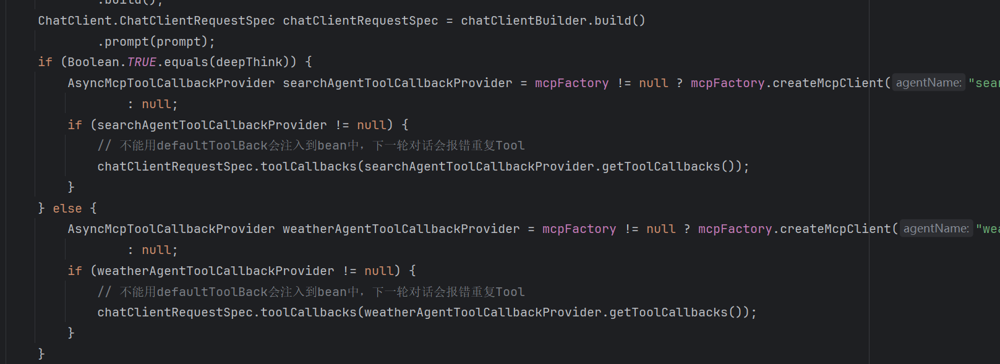

另外需要注意的是，在web项目，使用原生MCP API创建MCP客户端的时候必须采用`HttpClientSseClientTransport`

而在webflux项目，则必须采用`WebFluxSseClientTransport`

如果项目中有spring-web的依赖就证明是web项目，如果在web项目下使用`WebFluxSseClientTransport`则MCP客户端会初始化失败，表现程序自动发起initialize MCP请求之后，MCP会返回500，或者400的HTTP code，这并不是远程SSE不支持，而是本地的连接客户端的问题，具体可以跟踪源码进行DEBUG学习

### 列出所有MCP

通过`ToolRegistryService`可以做到列出所有MCP的功能

```java
@RestController
@RequestMapping("/mcp")
@Slf4j
public class McpController {

    @Resource
    private ToolRegistryService toolRegistryService;

    @GetMapping("/services")
    public RemoteResult<List<McpInfo>> getAllMcpServices() {
        List<ToolRegistryService.ToolDescription> registeredTools = toolRegistryService.getRegisteredTools();
        List<McpInfo> result = registeredTools.stream().map(registeredTool -> {
            McpInfo mcpInfo = new McpInfo();
            mcpInfo.setMcpName(registeredTool.name());
            mcpInfo.setMcpDesc(registeredTool.description());
            return mcpInfo;
        }).collect(Collectors.toList());
        log.info("getAllMcpServices: {}", result);
        return RemoteResult.success(result);
    }
}
```

返回后可以展示在前端页面，当然由于上面MCP创建已经动态化了，所以这里最好是做成取一次之后就缓存上MCP信息

## Prompt

Prompt工程是开发Agent的重要一环，ReAct、COT已经证明特定的精巧的Prompt能够进一步激发模型的潜力，除此之外现在业界已经探索出Planing And Execute、Supervisor等更加强大的多Agent协作模式，下面来解密一些经典Prompt的使用

### 原始Qwen ReAct Prompt

Qwen的ReAct Prompt是直接开源的，在[https://github.com/QwenLM/Qwen/blob/main/examples/react_prompt.md](https://github.com/QwenLM/Qwen/blob/main/examples/react_prompt.md)中，详细的描述了，如何使用ReAct Prompt模版来激发Qwen的工具调用能力，他的原始Prompt如下

```bash
TOOL_DESC = """{name_for_model}: Call this tool to interact with the {name_for_human} API. What is the {name_for_human} API useful for? {description_for_model} Parameters: {parameters} Format the arguments as a JSON object."""

REACT_PROMPT = """Answer the following questions as best you can. You have access to the following tools:

{tool_descs}

Use the following format:

Question: the input question you must answer
Thought: you should always think about what to do
Action: the action to take, should be one of [{tool_names}]
Action Input: the input to the action
Observation: the result of the action
... (this Thought/Action/Action Input/Observation can be repeated zero or more times)
Thought: I now know the final answer
Final Answer: the final answer to the original input question

Begin!

Question: {query}"""
```

上面主要包含了以下几个重要的部分

1. 工具的描述，以及调用工具需要传递的参数
2. Question、Thought、Action、Action Input、Observation的Loop循环，以及Final Answer
3. 用户的输入query

完全填充后的官方例子如下

```bash
Answer the following questions as best you can. You have access to the following tools:

quark_search: Call this tool to interact with the 夸克搜索 API. What is the 夸克搜索 API useful for? 夸克搜索是一个通用搜索引擎，可用于访问互联网、查询百科知识、了解时事新闻等。 Parameters: [{"name": "search_query", "description": "搜索关键词或短语", "required": true, "schema": {"type": "string"}}] Format the arguments as a JSON object.

image_gen: Call this tool to interact with the 通义万相 API. What is the 通义万相 API useful for? 通义万相是一个AI绘画（图像生成）服务，输入文本描述，返回根据文本作画得到的图片的URL Parameters: [{"name": "query", "description": "中文关键词，描述了希望图像具有什么内容", "required": true, "schema": {"type": "string"}}] Format the arguments as a JSON object.

Use the following format:

Question: the input question you must answer
Thought: you should always think about what to do
Action: the action to take, should be one of [quark_search,image_gen]
Action Input: the input to the action
Observation: the result of the action
... (this Thought/Action/Action Input/Observation can be repeated zero or more times)
Thought: I now know the final answer
Final Answer: the final answer to the original input question

Begin!

Question: 现在给我画个五彩斑斓的黑。
```

将这份提示词交给大模型后，模型会按照格式输出上诉的几个关键过程，之后开发者就可以根据Action和Action Input去调用Tool，同时需要将Observation设置为大模型的停用词，让模型等待Action调用完毕，当Tool调用完毕之后，可以将返回的参数拼接到Observation上，再一次组织Prompt，传递给大模型，比如

```bash
Answer the following questions as best you can. You have access to the following tools:

quark_search: Call this tool to interact with the 夸克搜索 API. What is the 夸克搜索 API useful for? 夸克搜索是一个通用搜索引擎，可用于访问互联网、查询百科知识、了解时事新闻等。 Parameters: [{"name": "search_query", "description": "搜索关键词或短语", "required": true, "schema": {"type": "string"}}] Format the arguments as a JSON object.

image_gen: Call this tool to interact with the 通义万相 API. What is the 通义万相 API useful for? 通义万相是一个AI绘画（图像生成）服务，输入文本描述，返回根据文本作画得到的图片的URL Parameters: [{"name": "query", "description": "中文关键词，描述了希望图像具有什么内容", "required": true, "schema": {"type": "string"}}] Format the arguments as a JSON object.

Use the following format:

Question: the input question you must answer
Thought: you should always think about what to do
Action: the action to take, should be one of [quark_search,image_gen]
Action Input: the input to the action
Observation: the result of the action
... (this Thought/Action/Action Input/Observation can be repeated zero or more times)
Thought: I now know the final answer
Final Answer: the final answer to the original input question

Begin!

Question: 现在给我画个五彩斑斓的黑。
Thought: 我应该使用通义万相API来生成一张五彩斑斓的黑的图片。
Action: image_gen
Action Input: {"query": "五彩斑斓的黑"}
Observation: {"status_code": 200, "request_id": "3d894da2-0e26-9b7c-bd90-102e5250ae03", "code": null, "message": "", "output": {"task_id": "2befaa09-a8b3-4740-ada9-4d00c2758b05", "task_status": "SUCCEEDED", "results": [{"url": "https://dashscope-result-sh.oss-cn-shanghai.aliyuncs.com/1e5e2015/20230801/1509/6b26bb83-469e-4c70-bff4-a9edd1e584f3-1.png"}], "task_metrics": {"TOTAL": 1, "SUCCEEDED": 1, "FAILED": 0}}, "usage": {"image_count": 1}}
```

拿着Tool调用后的Prompt，大模型会再次基于这些信息进行判断，是否还需要调用Tool，直到完成回答为止

整个过程可如下图所示

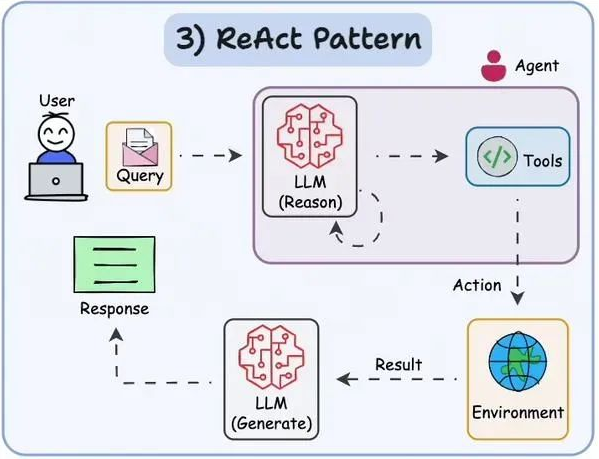

### 怎么手动实现ReAct

ReAct核心就是“思考(Thought) - 行动(Action) - 观察(Observation)”的循环

用伪代码来表示，它是这样的

```java
while (true) {  
    // 1、（Thought）大模型调用，根据大模型输出，判断是否需要工具调用，调用哪个工具，入参是什么    
    if (无需工具调用) {    
        break;  
    }
    // 2、（Action）工具调用
    // 3、（Observation）拿到工具调用的执行结果，追加到prompt中，回到1，进行下一轮LLM调用
}
```

这部分在社区中有更好的文章来解释， [200行极简demo - 学习如何手搓一个ReAct Agent](https://mp.weixin.qq.com/s/3lqCJ93jL5rkebnzO3WkjQ)，本文就不再赘述

后面将主要讲解在Spring AI环境下可以怎么做，Spring AI框架本身怎么做的，以及我们还需不需要这样做

### 在Spring AI环境下，怎么拿到工具的定义和入参

无论是连接内部工具还是外部工具，包括以后通过这些定义去定制Prompt，我们都有获取工具定义和参数的必要，这部分只能通过阅读源码进行探索

通常注册的MCP信息都有一个对应的Provider提供者，如`org.springframework.ai.tool.ToolCallbackProvider`

他有getToolCallbacks方法

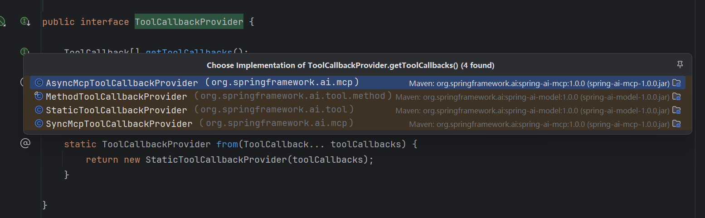

可以看到他对应的实现类包括异步、同步、静态、方法4个形态的Tool工具调用实现

而ToolCallback中就包含了ToolDefinition

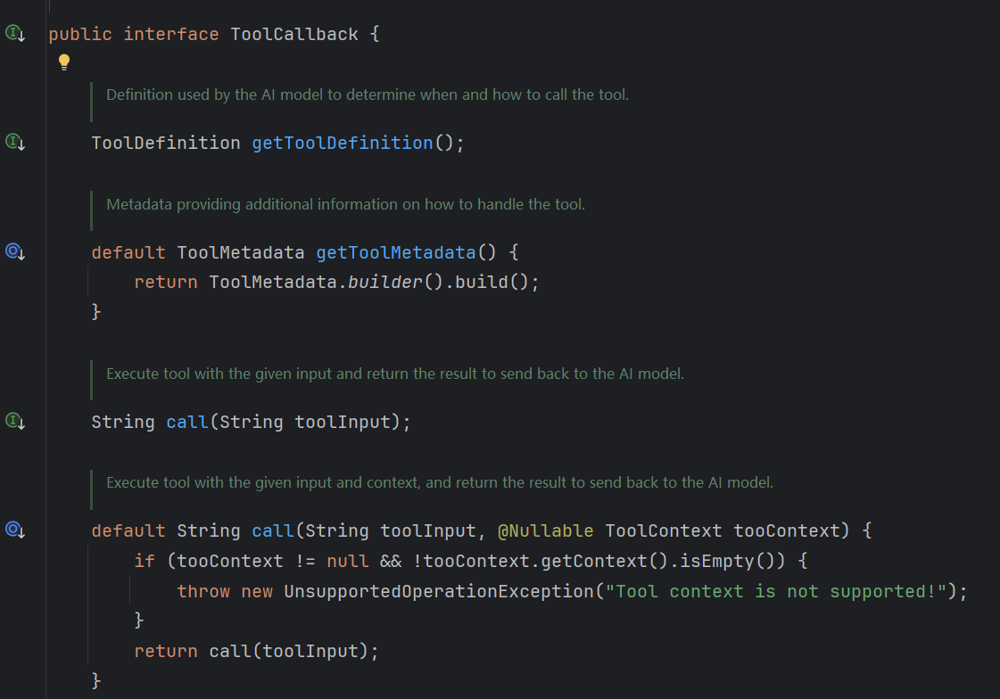

在ToolDefinition中，就定义了工具的名称(name)，工具的描述(description)，以及调用工具输入的参数(inputSchema)

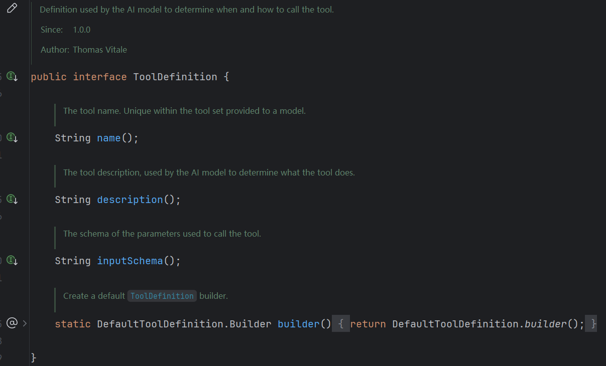

在原生ReAct情况下，比如上文的Qwen ReAct Prompt需要的工具信息，就需要这样去在模板上进行填充，在测试方法上，本地也保留了这种方式`BaseTest#testLoadPrompt`

### 有框架的情况下，还需要实现ReAct吗(工具调用源码解读)

Qwen的Prompt是2年前开源的，在开发这个项目的过程中，我发现无论是工具的调用，还是调用后根据结果再次反思，在Prompt层面我们已经不再需要自己去组装Tool的定义了。那么这一切到底是怎么做到的呢，处于好奇，我们可以debug进源码里面一探究竟

首先最顶层的节点就是stream()接口

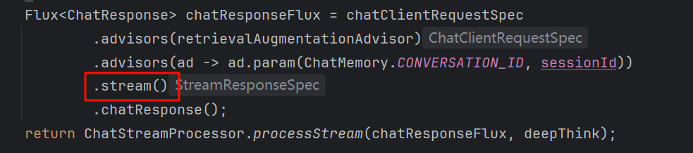

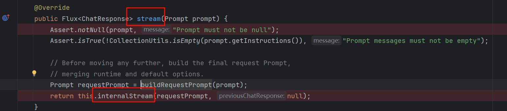

进来之后我们能看到`buildRequestPrompt`

这个方法主要是组装运行时的Prompt，以及将所有MCP工具定义绑定在这次请求的Prompt上

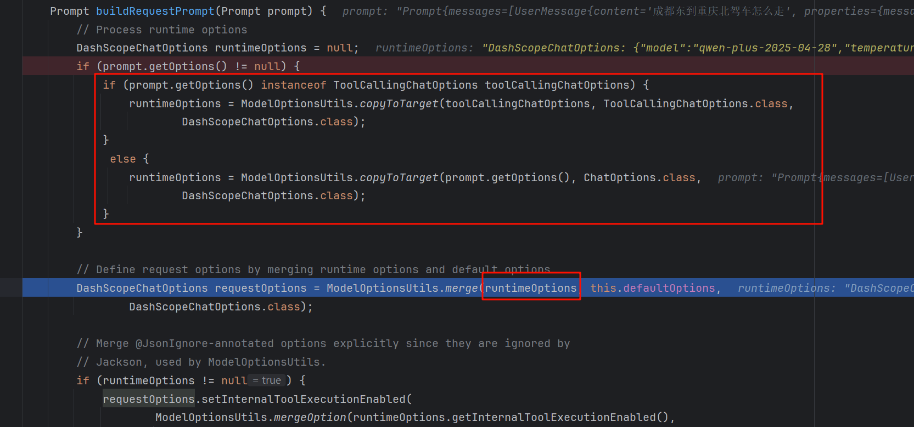

观察Debug堆栈，我们能看到runtimeOptions里面已经包含了所有可用的MCP工具定义

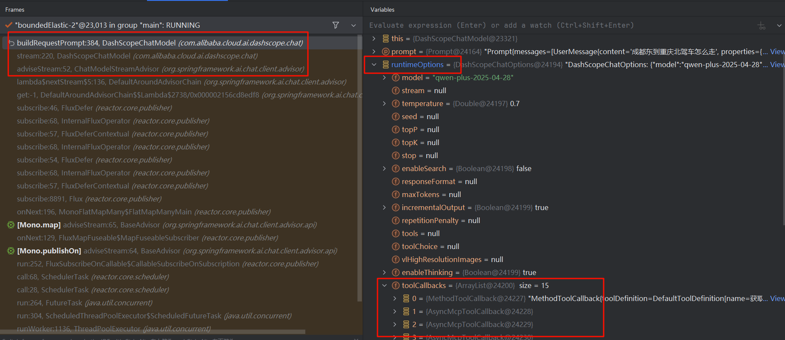

之后进入internalStream，看到红框的部分

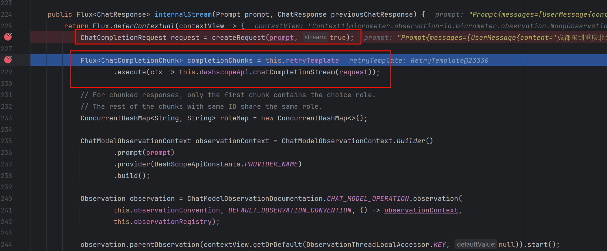

第一部分是根据Prompt组装请求参数，第二部分就是真实调用大模型

我们先看第一部分

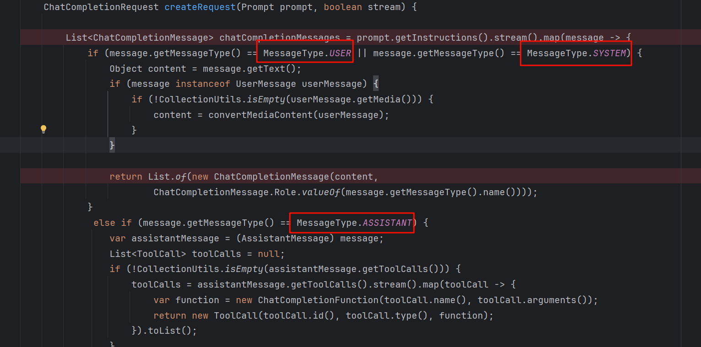

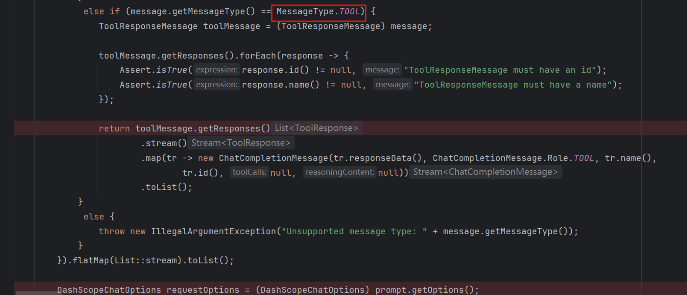

识别这次消息是User、System、Assisant、Tool的哪一种，然后去获取ToolDefinition，设置到Option中

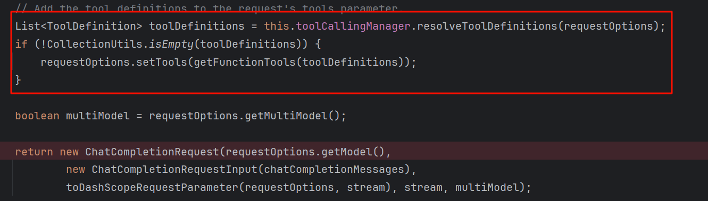

由于debug过程是用户提问了才有的请求，所以这次消息是User类型的

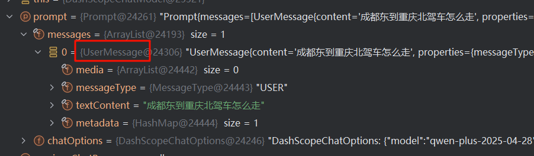

那么其他类型有什么用呢，我们接着往后走，回到internalStream方法

这次请求就需要调用大模型了，也就是`com.alibaba.cloud.ai.dashscope.api.DashScopeApi#chatCompletionStream(com.alibaba.cloud.ai.dashscope.api.DashScopeApi.ChatCompletionRequest)`

这个代码没什么好说的，就是Http调用了百炼平台的Api

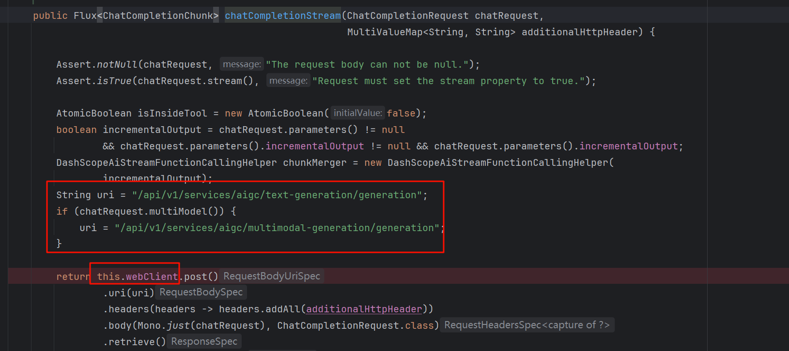

调用之后是个Flux流，等待异步返回，然后出去到这里，这一块的Observation不是ReAct模式下的Observation定义，他更多的是指的可观测的内容，所以这一块可以不用看

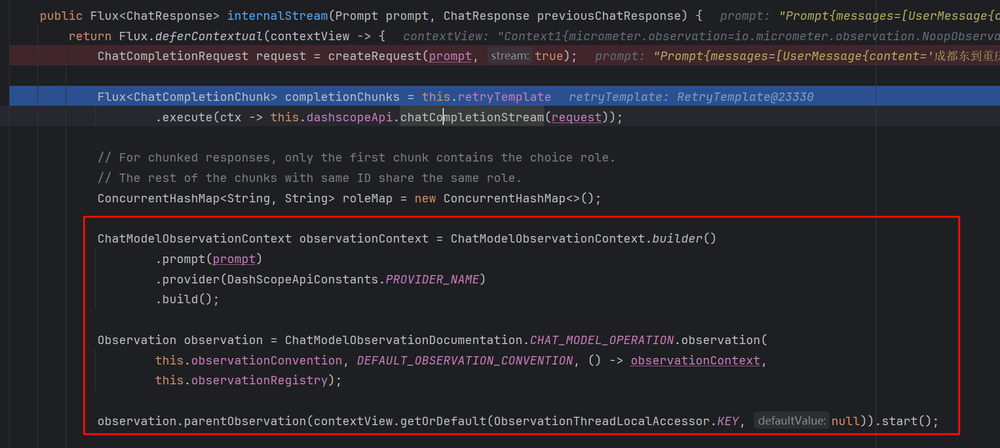

再往下走是工具调用的逻辑，先看下生成部分

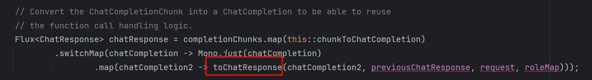

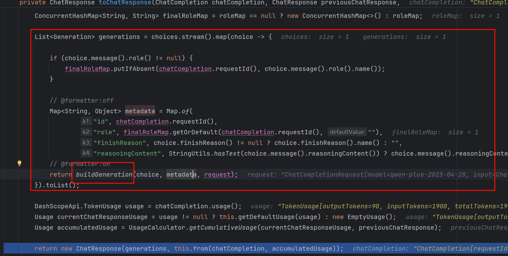

我们看到了id、role、finishReason、reasoningContent几个key，其中reasoningContent就是思考模型深度思考的过程，在buildGeneration中我们再次看到了tool调用的身影

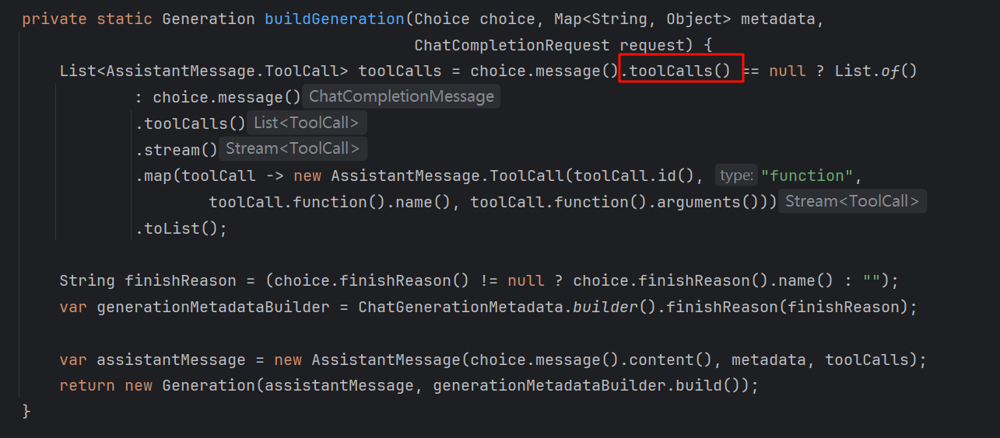

当模型返回的参数包含tool_call的json的时候说明模型需要调用tool了，这时候会反序列化为ToolCall的实体，实体包含了调用工具所需要的参数和，工具名称等

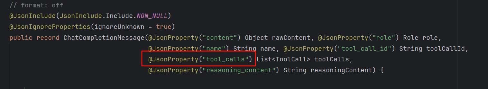

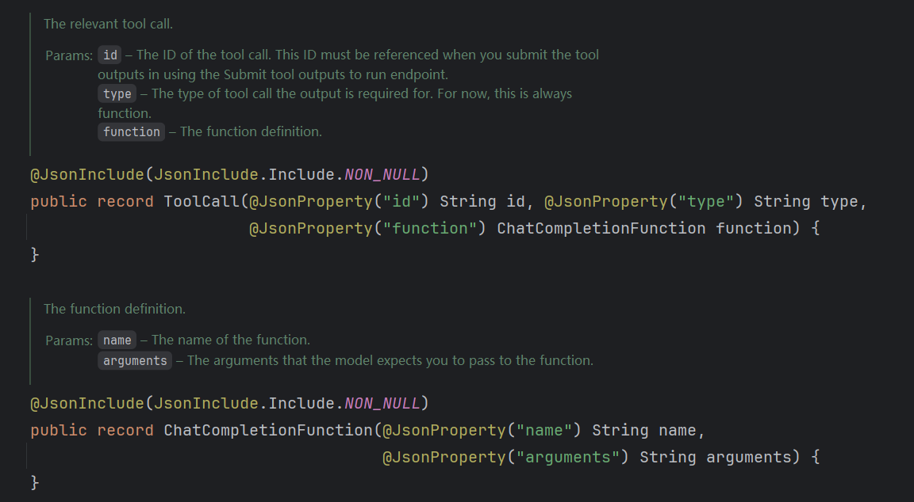

然后将这堆信息包装成一个Message，供后续使用generations返回的结构如下

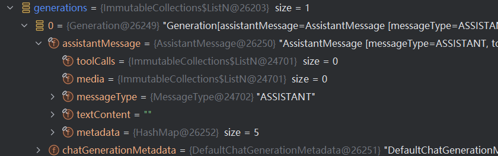

得到生成的回答之后退出来，回到internalStream

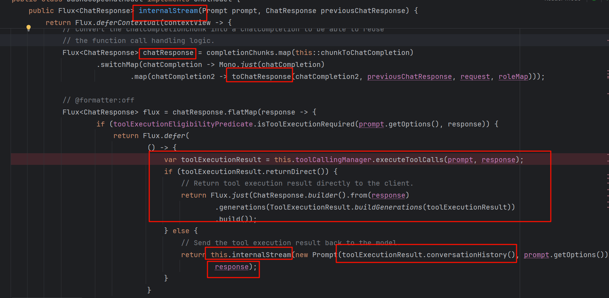

可以看到后面会对chatResponse进行处理，判断是否是需要工具调用的，如果需要调用则执行`org.springframework.ai.model.tool.ToolCallingManager#executeToolCalls`，**后续对工具的返回值returnDirect进行判断是否可以返回了，如果可以就返回给用户，如果不行就再次拿到工具调用后的会话历史，和当前的Prompt组装成一个新的Prompt再次递归internalStream，直到不再需要工具调用为止**，这个过程和ReAct是如出一辙的，但官方并没有这样去宣传，因为ReAct通常还有个递归深度的超参数设置

我们进入executeToolCalls，可以看到工具是如何真正执行的，主要有2个实现类，我们关注Default

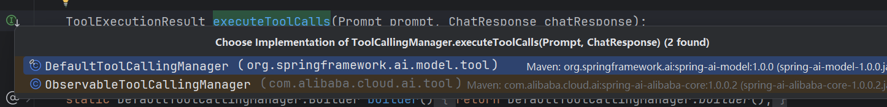

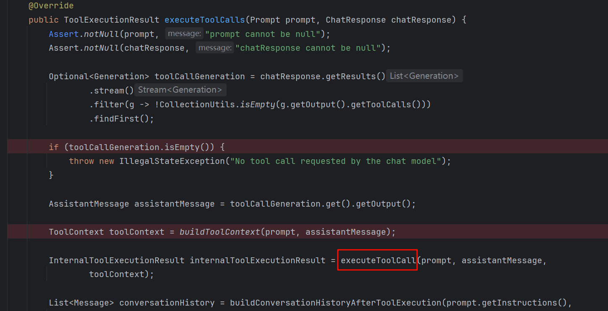

在这里主要将前面组装的Tool调用消息过滤出来，然后进行工具调用，继续跟进executeToolCall

可以看到拿到真实的ToolCallback之后就进行了call方法调用

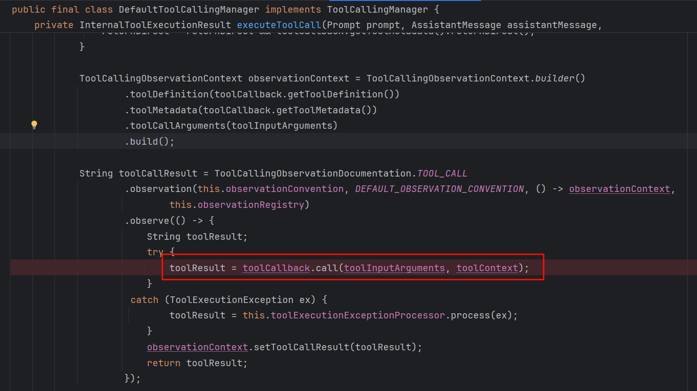

其中call方法有4个实现类，对应之前的4中MCP调用模式

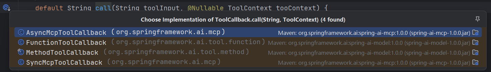

先看MethodToolCallback，这种模式就是@Tool定义的MCP

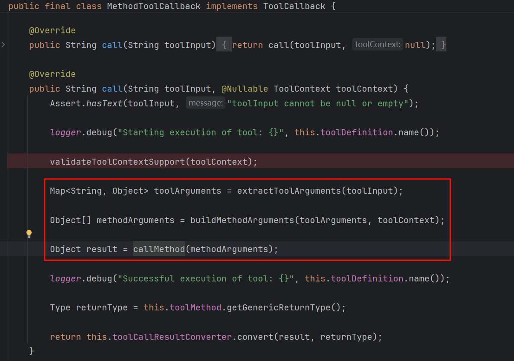


看代码大概也能猜到，最终是反射调用的

然后是异步SSE方式的调用


最后是由MCP官方包实现发起调用`io.modelcontextprotocol.client.McpAsyncClient`


其余2个实现也类似，值的注意的是MCP长连接的整个通信需要经常和远端交互，发送的请求不止的用户请求，还有的initialize初始化等，列出Mcp列表也需要调用远端请求

另外就是returnDirect的处理，决定了调用工具后是直接返回，还是再次交给模型处理


具体是这样赋值的


初始化的时候为空，第一次调用之后就会被赋值，当调用的所有Tool都可以返回的时候才能返回，这个returnDirect默认是false的


也就是说按照上面的逻辑，始终会将工具调用后的结果组装之后返回给大模型，再次去识别，整个源码中，只有@Tool的工具可以在注解上调整returnDirect的值


另外，tool调用前的可视化是这样的


工具调用之后，根据工具调用的结果再构建消息，之后回到最开始internalStream对消息的处理


整个源码过程可如下图所示


随着框架侧对于参数封装越来越好、模型侧训练时自带思维链，ReAct简单实现已经不再需要传统的组装Tool定义，以及告知模型思考步骤了，观察阿里云社区的官方文章，也有类似的观点

下面这张图展示，无额外Prompt情况下，模型也能够学会思考、观察、执行的过程，并多次调用不同的工具


模型思考过程

```java
好的，用户问的是从成都东到重庆北驾车怎么走。首先，我需要确定这两个地点的具体位置，可能需要用到地图服务。但用户已经明确是驾车路线，所以应该调用驾车路径规划的API。

查看可用的工具，发现有一个名为spring_ai_mcp_client_maps_direction_driving的函数，它的参数需要出发点和目的地的经纬度。不过用户提供的地点是成都东和重庆北，这两个都是火车站，可能需要先获取它们的准确坐标。

但可能用户已经知道具体的起点和终点坐标吗？或者是否需要先通过搜索获取这两个火车站的经纬度？比如，使用spring_ai_mcp_client_maps_text_search来搜索成都东站和重庆北站的坐标。不过用户的问题直接是驾车路线，可能假设用户已经知道坐标，或者可以直接通过名称转换为坐标。

不过，根据函数参数的要求，必须提供origin和destination的经纬度。所以可能需要先将成都东和重庆北转换为经纬度坐标。例如，使用spring_ai_mcp_client_maps_geo函数，将地址转换为经纬度。但该函数的参数需要地址和城市，比如成都东站位于成都市，地址可能是“成都东站”，城市“成都”；同样重庆北站地址是“重庆北站”，城市“重庆”。

所以步骤应该是：

1. 调用spring_ai_mcp_client_maps_geo获取成都东站的经纬度。
2. 调用同样的函数获取重庆北站的经纬度。
3. 然后使用这两个坐标作为参数调用spring_ai_mcp_client_maps_direction_driving获取驾车路线。

但用户的问题可能期望直接给出路线，而系统是否可以直接处理地址名称？或者是否需要先转换坐标？

根据现有的工具，驾车路线规划的函数参数需要经纬度，因此必须先获取两个地点的坐标。所以需要分两步，先转换地址为坐标，再调用驾车路线规划。

因此，首先需要为成都东和重庆北分别调用地址转经纬度的函数，然后将得到的坐标传给驾车路线规划函数。好的，用户问的是从成都东到重庆北驾车怎么走。我需要先确定两个地点的具体坐标，这样才能规划路线。

首先，用户已经调用了成都东站的地理编码，得到了坐标是104.141011,30.624201。接下来需要处理重庆北站的坐标。虽然用户没有明确说，但通常“重庆北”可能指的是重庆北站，所以应该用同样的方法获取它的坐标。

接下来应该调用spring_ai_mcp_client_maps_geo函数，参数是地址“重庆北站”和城市“重庆”。这样就能得到重庆北站的经纬度。一旦有了两个站点的坐标，就可以使用驾车路径规划函数spring_ai_mcp_client_maps_direction_driving，传入起点和终点的坐标，获取驾车路线。

不过用户可能希望直接得到路线信息，但根据工具列表，驾车规划需要出发点和目的地的经纬度。所以必须先获取重庆北站的坐标。因此，下一步应该是调用地理编码函数获取重庆北站的位置。这样才能继续后面的路径规划。好的，用户问的是从成都东到重庆北驾车怎么走。我需要先确定这两个地点的具体坐标，然后规划驾车路线。

首先，用户已经通过之前的工具调用获取了成都东站和重庆北站的经纬度。成都东站的坐标是104.141011,30.624201，重庆北站是106.549854,29.611148。接下来，我应该使用驾车路径规划的API，也就是spring_ai_mcp_client_maps_direction_driving这个工具，传入起点和终点的经纬度。

检查参数是否正确，origin应该是成都东的坐标，destination是重庆北的坐标。参数格式是经度,纬度，中间用逗号分隔。所以构造参数的时候需要确保格式正确。然后调用这个函数，返回驾车路线的信息，比如距离、预计时间、路线步骤等，再把这些信息整理成用户容易理解的回答。好的，用户问的是从成都东到重庆北驾车路线。首先我需要确认两个地点的具体坐标，因为成都东和重庆北可能有多个地点，但用户应该是指成都东站和重庆北站。

第一步，调用地图API将成都东站转换为经纬度。使用spring_ai_mcp_client_maps_geo函数，参数是地址“成都东站”和城市“成都”。返回的坐标是104.141011,30.624201。

接下来同样处理重庆北站，调用同样的函数，参数为“重庆北站”和城市“重庆”，得到坐标106.549854,29.611148。

然后需要规划驾车路线，使用spring_ai_mcp_client_maps_direction_driving函数，传入起点和终点坐标。返回的路线信息包含多个步骤，总距离约293公里，耗时约3小时18分钟。

检查步骤中的关键点，比如经过的主要道路和隧道，确保路线合理。用户可能需要知道大概的时间和主要路线，比如经过渝蓉高速等。另外，提醒用户注意高速收费站和隧道，确保行驶安全。最后整理这些信息，用简洁明了的语言
```


真实的Tool调用交互过程


### ReAct Prompt及失效原因

根据前文的源码分析，我们知道核心的调用是依靠大模型返回的tool_call，如果我们现在直接把类似Qwen的ReAct Prompt加入试试

Prompt如下

```java
请严格遵循以下格式要求：
1. 每个步骤必须独立一行（包括Question/Thought/Action/Action Input/Observation/Final Answer）
2. 输出语言必须与输入问题的语言保持一致

格式示例：
Question: [用户的问题]
Thought: [你的思考过程]
Action: [使用的工具名]
Action Input: [工具输入参数]
Observation: [工具返回结果]
...（可重复多次以上步骤）
Thought: 我已得出最终结论
Final Answer: [最终答案]

具体规则：
1. 每个标签（如Thought/Action等）后必须换行
2. 如果输入是中文，所有输出必须使用中文
3. 如果输入是英文，所有输出必须使用英文
4. 其他语言输入时，输出保持与输入相同的语言
5. 确保Action只使用提供的工具
6. Observation必须直接来自工具返回结果，不做修改
7. 最终答案必须基于Observation生成
```

根据上文，我们并不需要告知到底有哪些工具和工具的具体参数


我们看到模型好像是输出了类似的结果，但其实，后台API是没有观测到Tool调用的，而是大模型自己直接输出的


**由于System角色定义的优先级是最高的，这里我们指定了整个工具的输出key为Action Input，而其实内部工具调用是需要tool_call的**，模型丧失了Tool调用能力，反而产生了幻觉。为了验证这个想法，我同样在spring-ai-alibaba-openmanus的项目上增加了这段ReAct提示词，最终也导致了ReActAgent的工具调用失效

`com.alibaba.cloud.ai.example.graph.react.ReactAutoconfiguration#normalReactAgent`

这个ReActAgent绑定了一个天气工具，不使用ReAct Prompt时是可以正常查询天气的


日志显示了正常的工具调用


当加入了提示词


设定System提示词，最大迭代次数，


大模型回答同样也产生了类似的幻觉

**需要注意的是：**如果你在项目中之前没有采用ReAct Prompt进行提问，模型能够正确调用Tool，后来采用ReAct Prompt问同样的问题，模型还是会返回上一次对于该提问的回答，这时候你会发现，居然又能够调用Tool了，这是问题大模型侧已经对相同提问做了缓存的原因，**如果换一个问题，那么Tool调用还是会失效的**

### COT Prompt

论文中提到的一句简单的提示**“Let's think step by step”**，就能够让模型按步骤进行问题解答和推理，经过近两年的发展，COT已经融入到了模型内，思考模型大多数会自己进行COT推理，包括后面的COT变种，思维树和思维图等，下面是一个简单的思维链例子

首先是不用思维链，提问

```java
小明有5个苹果，小红的苹果数比小明的2倍还多3个，这时候小红吃掉了2个苹果，小明又吃掉了1个苹果，现在小红和小明总共还有几个苹果
```


然后是加入如下思维链提示，提问

提示词如下

```java
你是一个严谨的推理助手。请按以下步骤解决用户问题：
1. 识别问题核心要素
2. 分步分解推理过程（每一步需标明原因）
3. 整合所有信息得出结论

问题：你必须复述输入的问题

按以下格式输出：
推理步骤：\n\n
步骤1: [描述] (原因: ...) \n\n
步骤2: [描述] (原因: ...) \n\n
...
最终答案：
[明确答案]
```


可以看出来回答在细致程度上的差别，但由于COT已经提出了2年多的时间了，现有的大多数SOTA模型即使不使用COT提示，也可以回答得很有思维过程，所以这方面COT提示的作用，不会太大。如果对于较早的模型，COT提示会比较有用

## 深度思考模式

### 怎么开启深度思考

1. 需要使用思考模型
2. 如果采用Qwen系列模型，接入spring-ai-alibaba-starter-dashscope的api，并在yml或SDK端开启enableThinking，如之前源码解读一样，需要识别`reasoningContent`作为思考过程
3. 如果采用兼容OpenAI系列的模型，接入spring-ai-autoconfigure-model-openai，暂时还没找到开关

### 如何处理深度思考返回

根据返回的Flux流进行处理，对于Qwen系列，Text部分就是最终答案，reasoningContent部分就是思考过程，获取到对应的消息之后，通过判断推送不同的事件给前端，前端监听到事件后进行渲染就可以实现思考过程和答案的显示

```java
@Slf4j
public class ChatStreamProcessor {

    /**
     * 处理chat模式Flux流
     *
     * @param chatResponseFlux 模型回答Flux流
     * @param deepThink        是否开启深度思考
     * @return Flux<ChatEvent>
     */
    public static Flux<ChatEvent> processStream(Flux<ChatResponse> chatResponseFlux, Boolean deepThink) {
        return chatResponseFlux
                .flatMapIterable(response -> processGenerations(response, deepThink))
                .onErrorResume(ChatStreamProcessor::handleError);
    }

    private static List<ChatEvent> processGenerations(ChatResponse response, Boolean deepThink) {
        return response.getResults().stream()
                .flatMap(generation -> buildEvents(generation, deepThink).stream())
                .collect(Collectors.toList());
    }

    private static List<ChatEvent> buildEvents(Generation generation, Boolean deepThink) {
        List<ChatEvent> events = new ArrayList<>();
        AssistantMessage msg = generation.getOutput();
        Map<String, Object> metadata = msg.getMetadata();
        // 深度思考处理
        if (Boolean.TRUE.equals(deepThink)) {
            Optional.ofNullable(metadata.get("reasoningContent"))
                    .map(Object::toString)
                    .filter(content -> !content.isEmpty())
                    .ifPresent(reasoning ->
                            events.add(new ChatEvent(ChatEvent.EventType.THINKING, reasoning, true)));
        }
        // 最终答案处理
        Optional.of(msg.getText())
                .filter(text -> !text.isEmpty())
                .ifPresent(answer ->
                        events.add(new ChatEvent(ChatEvent.EventType.ANSWER, answer, false)));

        return events;
    }

    private static Publisher<? extends ChatEvent> handleError(Throwable e) {
        if (e instanceof TimeoutException) {
            log.error("流处理超时", e);
            return Flux.just(new ChatEvent(ChatEvent.EventType.ANSWER, "处理超时，请稍后再试", false));
        }
        log.error("流处理错误", e);
        return Flux.just(new ChatEvent(ChatEvent.EventType.ANSWER, "处理失败: " + e.getMessage(), false));
    }
}
```

## Observation可观测

### Tool调用可观测性

这一部分代码主要参考了spring-ai-alibaba-deepsearch项目中代码，由于上文中采用ReAct Prompt会形成Prompt注入的情况，产生强烈的幻觉，日志上也没有显示到底真正调用Tool没有，所以对于Tool调用的可观测显得非常有必要存在，这份代码主要就是实现了ToolCalling在开始和结束时候的日志打印

也在项目中的`observation`包下

```java
@Configuration
@EnableConfigurationProperties({ ObservationProperties.class })
@ConditionalOnProperty(prefix = ObservationProperties.PREFIX, name = "enabled", havingValue = "true",
		matchIfMissing = true)
public class ObservationConfiguration {

	private static final Logger logger = LoggerFactory.getLogger(ObservationConfiguration.class);

	@Bean
	public ObservationHandler<ToolCallingObservationContext> toolCallingObservationContextObservationHandler() {
		return new ObservationHandler<>() {
			@Override
			public boolean supportsContext(Observation.Context context) {
				return context instanceof ToolCallingObservationContext;
			}

			@Override
			public void onStart(ToolCallingObservationContext context) {
				ToolDefinition toolDefinition = context.getToolDefinition();
				logger.info("🔨ToolCalling start: {} - {}", toolDefinition.name(), context.getToolCallArguments());
			}

			@Override
			public void onStop(ToolCallingObservationContext context) {
				ToolDefinition toolDefinition = context.getToolDefinition();
				logger.info("✅ToolCalling done: {} - {}", toolDefinition.name(), context.getToolCallResult());
			}
		};
	}

	@Bean
	@ConditionalOnMissingBean(name = "observationRegistry")
	public ObservationRegistry observationRegistry(
			ObjectProvider<ObservationHandler<?>> observationHandlerObjectProvider) {
		ObservationRegistry observationRegistry = ObservationRegistry.create();
		ObservationRegistry.ObservationConfig observationConfig = observationRegistry.observationConfig();
		observationHandlerObjectProvider.orderedStream().forEach(observationConfig::observationHandler);
		return observationRegistry;
	}

}
```

## 从Dify DSL一键导出为SAA Graph项目

用Dify编排Agent雏形非常容易上手，但是Dify面临着性能差，细节不好定制的问题，在Spring AI Alibaba Graph中提供了一个一键从Dify DSL导出为Spring AI Alibaba Graph的功能

具体在`spring-ai-alibaba-graph-studio`这个项目


首先我们不需要更改任何东西直接启动这个项目，项目启动之后前往Dify导出对应工作流的DSL的yaml文件


文件如下


之后需要在Postman发起请求(也可以是其他，只要能够支持传参包含DSL空行就行)，由于是下载文件所以右上角选择，Send And Dowload，DSL传参粘贴DSL的yaml


由于包含DSL的Curl过长，这里只给出一个不包含DSL的Curl

```http
curl --request POST \
  --url http://localhost:8080/starter.zip \
  --header 'Accept: */*' \
  --header 'Accept-Encoding: gzip, deflate, br' \
  --header 'Connection: keep-alive' \
  --header 'Cookie: JSESSIONID=4576FE6B20C0D66CDC8D14D01040FDB0' \
  --header 'User-Agent: PostmanRuntime-ApipostRuntime/1.1.0' \
  --data 'dependencies=spring-ai-alibaba-graph,web,spring-ai-alibaba-starter-dashscope' \
  --data appMode=workflow \
  --data type=maven-project \
  --data language=java \
  --data bootVersion=3.5.0 \
  --data baseDir=demo \
  --data groupId=com.example \
  --data artifactId=demo \
  --data name=demo \
  --data 'description=Demo project for Spring Boot Alibaba Graph' \
  --data packageName=com.example.demo \
  --data packaging=jar \
  --data javaVersion=17 \
  --data dsl=
```

导入本地后可以各自填充带换行符的DSL调用

然后发起请求，后台表现200成功


生成的项目打开就是基于Spring AI Alibaba Graph的项目了


## SAA基于人类中断的Graph状态图

了解State Machine状态机的同学学习状态图是比较容易的，状态图主要就是有向无环图中去串联关键流程，实现状态的存储和恢复，以及条件边的控制

比如以下例子

1. 在用户完成关键参数输入之前Agent不会去执行特定的推荐逻辑，会要求用户补充完全关键信息
2. 当推荐出来商品之后，这个商品是否需要下单或者加入购物车是应该由用户决定的，所以状态图应该能够中断
3. 在用户有反馈之后，根据反馈决定是否下单或者不执行等操作

这部分的样例代码只能参考spring-ai-alibaba下的deepsearch、jmanus等项目，或者example的仓库来进行学习，整体来说分为2个接口，一个接口用来chat调用，另外一个接口用来恢复断点。

在spring-ai-alibaba-openmanus的实现中

状态图的定义如下


指定在执行完毕planning之后，interruptBefore中断在人类节点，需要反馈之后才往下执行

其中chat接口和断流恢复接口如下


由于时间关系，这部分没有实现，类似的效果可如下所示自行体验，[https://demo.haoranai.com/home/aishop](https://demo.haoranai.com/home/aishop)

### 关键节点控制


当用户提问之后根据意图识别结果，回答对应的问题，要求用户填写关键信息

这里我只输入了年龄

模型侧收到消息后，判断出条件不够充分，要求补充性别、身高、体重然后才能进行推荐

**补充完毕信息之后，推荐出来了商品，并在这时候断流，让用户自主决策是否需要加入购物车**


这部分就属于关键的节点控制，比如用户下单、用户支付等等，比起传统的让前端来根据后端返回进行判断，基于后端StateGraph的编排能够让大模型的执行和回答更加具有确定性


我们可以很明显得看到断流interrupt的返回

### 断点恢复

之后用户操作之后又需要从上一次的状态图节点进行恢复进入下一个步骤，这通常是另外的一个接口，比如加入购物车之后


## 如何利用AI快速制作前端项目

比如我是一个后端，我应该怎么给AI说让他生成一个符合我后端接口的前端代码，这个项目的页面就是全靠AI生成的


### 创建项目阶段

```java
你是一个资深的AI软件开发专家，现在我需要实现一个RAG的MVP系统
用户可以从页面上传文档，形成知识库，前端采用tw、css、js、html实现
左侧包括已经上传文档的列表，以及开启新的对话，每个对话都是用新的seesionId
上传文档时调用接口/file/import/documents，参数为file，userId，seesionId
左侧已上传文档列表调用接口/file/search/document，参数为userId
下方发起对话调用接口/chat采用打字机效果展示流式输出
要求外表美观，尽量使用国内的css，js或front链接，你不需要实现后端，只需要实现前端的部分
```

给定AI的角色，限制技术栈，然后给出需要对接的接口和效果，如果需要非常准确的对接接口，建议后端直接给出如下形式

```
需要对接的接口
/file/search/document

必传参数
userId

请求类型
GET

返回值Json
{
    "success": true,
    "resultCode": "0",
    "resultMsg": "",
    "t": [
        {
            "docId": [
                "db414be9-35a9-45a9-99e0-845779923deb",
                "f149144f-82e1-428f-b1e3-78e70d22298d",
                "fa223493-01da-4304-a842-3327e48d9cd7",
                "326fb591-7f6b-4f3b-bca4-adcad65a54e5",
                "13f0ffcc-1892-4b43-bc0e-3488dc7b92ac",
                "70a45782-fa64-47d4-b163-c713d06e99c0",
                "12519e6c-683d-43f3-9a36-f3be3b1d7ae8",
                "12da1884-de14-48c0-9921-a2031a532445",
                "a4b9d6ad-d4d0-482f-a63f-8fd8ee471e7b",
                "f0c05d3e-2b61-448c-8096-4468fd451ced"
            ],
            "fileName": "deadurl.txt",
            "fileType": "txt"
        },
        {
            "docId": [
                "1cfaa3e3-64bf-482f-b1b4-371a8aaffd85"
            ],
            "fileName": "机器信息.md",
            "fileType": "md"
        }
    ],
    "currentTime": "0"
}
```

AI能够很好的完成整个任务

### 修改问题代码阶段

```java
你是一个资深的前端开发工程师
你只能够使用tw css，html和js，请在尽可能不大量变动代码的情况下，帮助我修改代码
我的要求是如果用户开启了深度思考模式，用户输入完毕发起聊天之后，思考区域可能暂时会没收到后端的流式消息
为了更好的用户体验，在收到后端流式消息前，思考区域就默认显示思考中，并加上一定的动效，开始计算并显示思考时间
如果接受到了think的消息就打印对应的思考内容，替换掉原本等待时候显示的思考中
另外一旦用户开启对话，则左侧历史对话栏应该显示当前的对话框
你只需要给出关键的代码修改位置和修改的代码，
按照
旧代码：
新代码：
排列出来就行
    
我的代码是
<!DOCTYPE html>
<html lang="zh-CN">
<head>
    <meta charset="UTF-8">
    <meta name="viewport" content="width=device-width, initial-scale=1.0">
    <title>Spring AI Chat Demo</title>
    <!-- 使用国内CDN引入Tailwind CSS -->
    <script src="https://cdn.jsdelivr.net/npm/marked/marked.min.js"></script>
    <link href="https://cdn.jsdelivr.net/npm/tailwindcss@2.2.19/dist/tailwind.min.css" rel="stylesheet">
    <link rel="stylesheet" href="https://cdn.jsdelivr.net/npm/@fortawesome/fontawesome-free@6.4.2/css/all.min.css">
    <style>
        .message-bubble-content {
            max-width: 100%;
            word-wrap: break-word;
            padding: 1rem;
            border-radius: 0.75rem;
            background-color: #f8fafc;
            box-shadow: 0 1px 3px rgba(0,0,0,0.1);
        }
// 省略
<!DOCTYPE html>
```

这对于大多数代码在一个文件中的不会前端的选手而言，能够避免绝大多数无用的输出，有时候更改代码逻辑仅仅需要更改很少的一部分，尤其是页面大部分已经确定的情况下


当然也可以使用Cusor等AI编程工具，但是需要注意为Cusor定义mdc工程规则，避免出现明明上一轮代码是对的，下一轮又改错了。可以参考这篇文章[AI写代码的“上下文陷阱”：为什么AI总是写错？如何系统性解决？](https://mp.weixin.qq.com/s/dAknYxHhGd0xDNqn9cB73Q)
